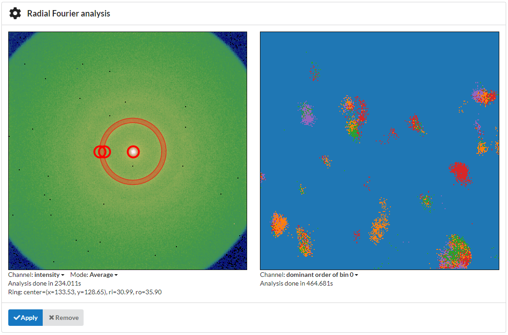
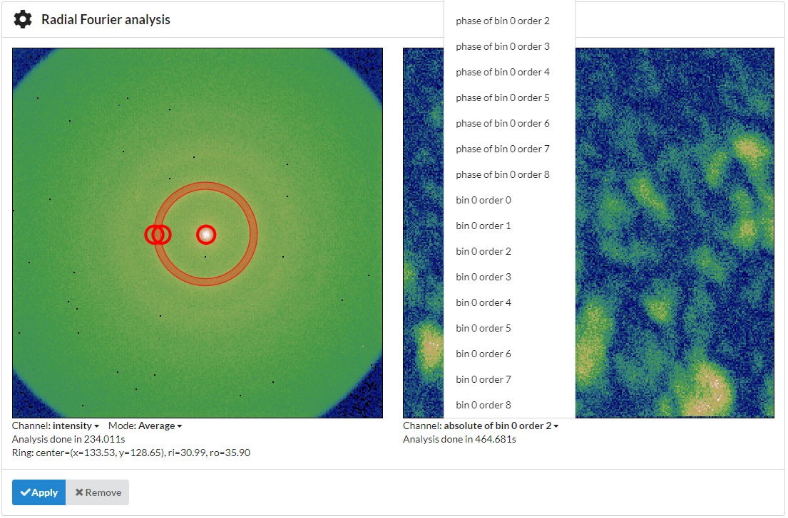
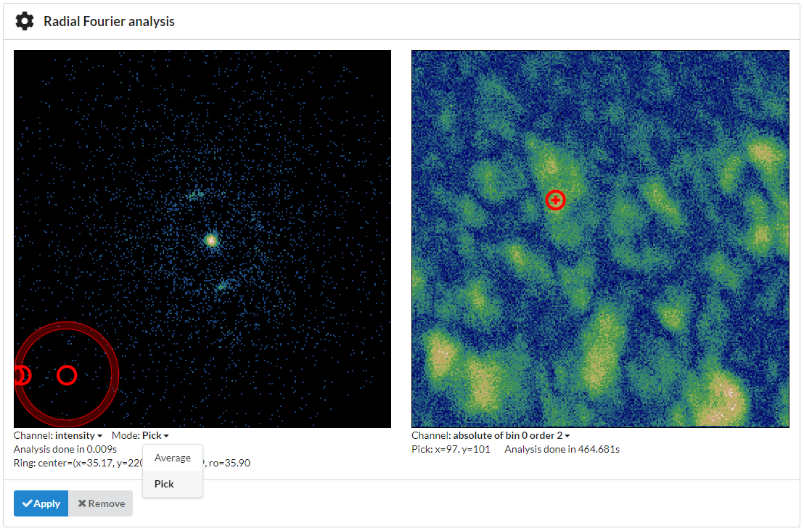

Amorphous materials
===================

Methods to determine the local order or crystallinity of amorphous and nanocrystalline materials.

Fluctuation EM
~~~~~~~~~~~~~~

TODO

Radial Fourier Series
~~~~~~~~~~~~~~~~~~~~~

Fluctuation EM doesn't evaluate the spatial distribution of intensity. It only works if enough intensity accumulates in each pixel so that local ordering leads to larger intensity variations than just random noise, i.e. if statistical variations from shot noise average out and variations introduced by the sample dominate.

If most of the detector pixels are only hit with one electron or none, the standard deviation between detector positions in a region of interest is the same, even if pixels that received electrons are spatially close, while other regions received no intensity. That means Fluctuation EM doesn't produce contrast between amorphous and crystalline regions if the detector has a high resolution, and/or if only low intensity is scattered into the region of interest.

The Radial Fourier Series Analysis solves this problem by calculating a Fourier series in a ring-shaped region instead of just evaluating the standard deviation. The angle of a pixel relative to the user-defined center point of the diffraction pattern is used as a phase angle for the Fourier series.

Since `diffraction patterns usually show characteristic <http://xrayweb.chem.ou.edu/notes/symmetry.html>`_ `symmetries <https://en.wikipedia.org/wiki/Friedel%27s_law>`_, the strength of the Fourier coefficients of orders 2, 4 and 6 highlight regions with crystalline order for even the lowest intensities. With the `relationship between variance in real space and power spectral density in frequency space <https://en.wikipedia.org/wiki/Parseval%27s_theorem>`_, the sum of all coefficients that are larger than zero is equivalent to the standard deviation, i.e. Fluctuation EM. Only summing coefficients from lower orders corresponds Fluctuation EM on a smoothened dataset.

The phase angle of selected coefficients, for example first or second order, can be used for in-plane orientation mapping similar to :cite:`Panova2019`.

Please note that this method is new and experimental and still needs to be validated further. If you are interested in helping us with applications and validations, that would be highly appreciated!

GUI use:
--------

You can select "Radial Fourier" from the "Add Analysis" menu in the GUI to add a Radial Fourier Series Analysis.

..  figure:: ./images/radialfourier/select.png 

Use the controls on the left to position the ring-shaped selector over the region you'd like to analyze and then click "Apply".

Under the right-hand side image you can select the channel to display. Available are absolute value, phase angle and a cubehelix vector field visualization of the complex number. The orders larger than zero are all plotted on the same range and are normalized by the zero-order component for each scan position to make the components comparable and eliminate the influence of absolute intensity variations in the visual display.

You can select entries with the arrow keys on the keyboard in case the menu is outside the browser window. Your help with a more user-friendly GUI implementation would be highly appreciated!

Pick mode comes in handy to inspect individual frames:

Scripting interface
-------------------

The scripting interface allows to calculate more than one bin at a time and influence the number of orders that are calculated. It relies on the sparse matrix back-end for MaskJob and allows to calculate many orders for many bins at once with acceptable efficiency.

Having a fine-grained analysis with many orders calculated as a function of radius allows for a number of additional processing and analysis steps:

.. include:: radialfourier.py
    :code:
