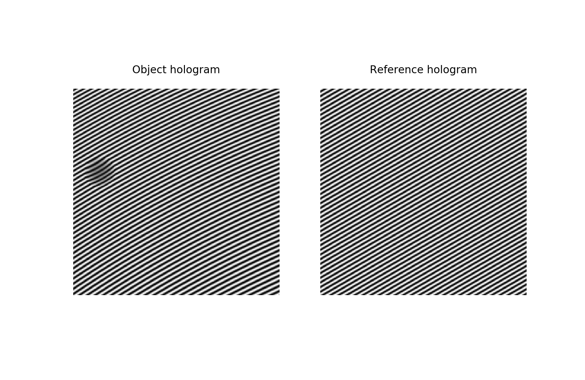

Off-axis electron holography
============================

Hologram simulation
-------------------
Holograms can be simulated using the method described by Lichte et al.
The simulator includes simulation of holograms with Gaussian and Poisson noise, without effect of
Fresnel fringes of biprism. The simulator requires amplitude and phase images being provided. Those can be
calculated as in example bellow in which for amplitude a sphere is assumed, the same sphere is used
for the mean inner potential (MIP) contribution to the phase and in addition to the quadratic long-range
phase shift originating from the centre of the sphere:

.. testcode:: autoudf

   import numpy as np
   import matplotlib.pyplot as plt
   from libertem.utils.generate import hologram_frame

   # Define grid
   sx, sy = (256, 256)
   mx, my = np.meshgrid(np.arange(sx), np.arange(sy))
   # Define sphere region
   sphere = (mx - 33.)**2 + (my - 103.)**2 < 20.**2
   # Calculate long-range contribution to the phase
   phase = ((mx - 33.)**2 + (my - 103.)**2) / sx / 10.
   # Add mean inner potential contribution to the phase
   phase[sphere] += (-((mx[sphere] - 33.)**2 \
                      + (my[sphere] - 103.)**2) / sx / 3 + 0.5) * 5.
   # Calculate amplitude of the phase
   amp = np.ones_like(phase)
   amp[sphere] = ((mx[sphere] - 33.)**2 \
                  + (my[sphere] - 103.)**2) / sx / 3 + 0.5

   To generate object hologram `amp` and `phase` should be passed to the `holo_frame` function as follows.

   # Simulate object and reference holograms
   holo = hologram_frame(amp, phase)
   ref = hologram_frame(np.ones_like(phase), np.zeros_like(phase))

   # Plot
   f, ax = plt.subplots(1, 2)
   ax[0].matshow(holo, cmap='gray')
   ax[0].title('Object hologram')
   ax[0].set_axis_off()
   ax[1].matshow(ref, cmap='gray')
   ax[1].set_axis_off()

Hologram reconstruction
-----------------------

LiberTEM can be used to reconstruct off-axis electron holograms using Fourier space method. The processing involves
following steps:

* Fast Fourier transform
* Filtering of the sideband in Fourier space and cropping (if applicable)
* Centering of the sideband
* Inverse Fourier transform.

Scripting interface
~~~~~~~~~~~~~~~~~~~

The reconstruction can be accessed through the :class:`~libertem.udf.holography.HoloReconstructUDF` class.
For example holoHaving generated p:

