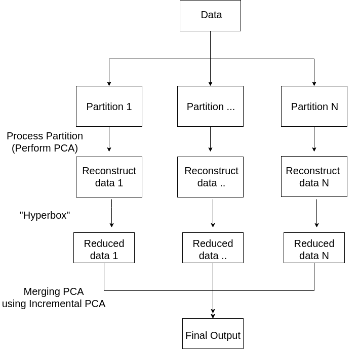
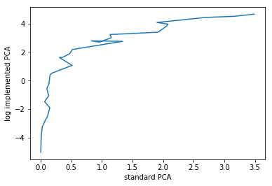

Principal Component Analysis
============================

Principal Component Analysis (herefrom referred to as PCA) is one of the most commonly used dimension reduction methods in scientific research. In short, PCA finds directions with largest variance in the data through orthogonalization of the vector space that the data lies in. PCA is relatively simple to implement compared to other methods and produces deterministic output, making it one of the most popular dimension reduction methods. However, PCA involves heavy matrix operations, which can be increasingly burdening as the data becomes large. Here, we exploit the distributed properties of User-Defined Functions (UDF) architecture by conjoining variations of PCA algorithms to obtain scalability for PCA.

How PCA works
-------------

As mentioned above, PCA heavily exploits the distributed nature of the UDF architecutre. First, using the partitioned data from the partitioning stage of UDF, we perform standard PCA on each of the partitions. Note that the current implementation utilizes :meth:`~libertem.udf.UDFFrameMixin.process_partition` instead of :meth:`~libertem.udf.UDFPartitionMixin.process_frame` to provide additional boost in the performance of the algorithm. Then, for each partition, we store the values for the loading matrix (matrix multiplication of the left singular matrix with the singular values), and the component matrix which is of our primary interest since the component matrix serves as a projection matrix into the lower-dimensional space and thereby achieving dimension reduction.

Once PCA is independently applied on all partitions, we proceed to `merge` these results of independent PCA results, which is done rather naturally by implementing the :meth:`~libertem.udf.UDF.merge` method in UDF class. More specifically, given the results of the PCA on each partition, we first reduce the dimension of the data matrix via `hyperbox` method. `Hyperbox` method is a way to reduce the dimension of the loading matrix by finding the maximal `hyperbox` that contains the span of the vectors in the loading matrix. In doing so, we can find a simpler description for the loading matrix, which then reduces the dimension of the data, thereby leading to an increase in the overall performance. Note that the sole purpose of applying `hyperbox` method to the loading matrix is to reduce the dimension of the data matrix while maintaining good approximation for the component matrix. After all, our primary interest lies in finding the component matrix in an efficient manner, and not in obtaining good approximation for the loading matrix because the component matrix is what will allow us to perform a projection of the original matrix. At each iteration, once `hyperbox` method is performed for the partition, we reconstruct the data with reduced dimension and use Incremental PCA algorithm (IPCA) to incrementally update the component matrix by fitting the post-`hyperbox` data matrix. One major advantage of IPCA is that it can easily handle large-size data that standard PCA algorithm cannot, and UDF architecture served as a basis for implementing Incremental PCA. 

How to use PCA
--------------
Using the UDF interface of LiberTEM, PCA requires two parameters: the data with which one wishes to reduce the dimension and the number of components to retain for dimension reduction. Note that the number of components is crucial in determining how much of the information in the original data one would like to retain. For instance, if one specifies a large number of components, then the reconstruction error would be small and most of the information is captured in the PCA-projected data. However, in this case, PCA would take longer time to process. Therefore, one needs to be aware of the trade-offs between performance and accuracy when determining how many number of components to use. Once one has specified the number of components, PCA can be used as following:

.. include:: ./pca.py
   :code:

The above code then returns a projected matrix with reduced dimension. A row of this projected matrix represents an image and a column of this projected matrix represents feature vectors that comprise the image. 

Testing schemes for validity of PCA (In progress)
-------------------------------------------------
To test strengths and weaknesses of our PCA method, multiple testing schemes were implemented.

Firstly, we devised several perturbation schemes in which the data matrix was perturbed, to confirm the robustness of the implemented PCA. As a benchmark dataset, we first generated a data set with dimension `1024 x 1024` using 100 component vectors. To check the robustness, we 1) added random noise to the matrix, 2) replaced some proportion of rows (i.e., images) with pure noise, and 3) altered the intensity, or scale, of each component vector. Then we compared the reconstruction error, which is the difference between the original data matrix and the data matrix reconstructed using the component vectors obtained from PCAs, of the implemented PCA and the standard PCA. As it turns out, the difference was negligible and the implemented PCA performed on par with the standard PCA. 

Secondly, we tried to exploit the potential pitfalls of the `hyperbox` method of the implemented PCA. An intuitive interpretation of `hyperbox` method is that we are enclosing the high-dimensional data with a hypercube, which, by design, includes all the points in the data. Therefore, we attempted to generate a data with heavy tail distribution, so that data points are more clustered around the edges. To achieve this, we fixed the component matrix and designed the loading matrix in such a way that each entry of the matrix is drawm from 1) exponential distribution, 2) gamma distribution, and 3) hand-crafted bimodal distribution. The result of this experiment was that none of the distributions led to the failure of the implemented PCA over the standard PCA, thereby showing the versatility of the implemented PCA.

Lastly, we compare the relative efficiency of the new PCA method with the standard PCA on full batch data. As can be seen in the plot below, the new PCA performs worse than the standard PCA in terms of performance time. This is an expected outcome since the primary purpose of the new PCA is to handle a large scale data where the standard PCA cannot perform matrix operations. To obtain scalability, some level of performance time was sunken, in particular as we incrementally perform PCA on a partitioned batch of data. 

As can be seen in the results above, the vulnerability of the PCA method need to be tested further, until either we obtain a mathematical guarantee that the implemented PCA converges to the standard PCA on full batch data or discover an edge case in which the implemented PCA fails while the standard PCA succeeds.

Additional Information
----------------------
For additional information on PCA, including its performance in comparison with standard PCA and various testing schemes to ensure the credibility of the method, please `follow this link to a jupyter notebook. <pca.ipynb>`_

Reference
---------
D. Ross, J. Lim, R. Lin, M. Yang. Incremental Learning for Robust Visual Tracking, International Journal of Computer Vision, Volume 77, Issue 1-3, pp. 125-141, May 2008.
