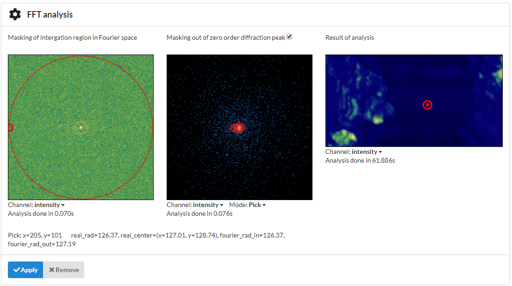

Phase-change materials
======================
Phase-change materials are some of the most promising materials for data-storage applications. In this application section, the pixelated STEM dataset with the AgInSbTe phase-change material specimen will be processed. Distinguishing between amorphous and crystalline regions can be hard in microstructure analysis with 4-D-STEM because of low contrast between them during the two most common method of visualization: bright and dark field imaging. The main difference of pixelated diffraction patterns for each of the beam positions the presence of additional (non zero-order) diffraction peaks in crystalline frames, while the amorphous frames have only the zero-order peak. Detection of the positions of additional peaks for all frames of crystalline regions will allow gaining information on the crystal structure.

Next, will be described methods to distinguish crystalline and amorphous regions in phase-change materials.

Crystallinity map
~~~~~~~~~~~~~~~~~
First, two different types of the regions, crystalline (low resistance) and amorphous (high resistance), should be distinguished. Crystalline regions are characterized by the presence of additional non-zero
diffraction peaks on diffraction image, while the diffraction image (the frame) of amorphous regions contains only the zero-order diffraction peak.
The presence of additional periodic diffraction peaks leads to differences in the Fourier spectrum of the crystalline frames compared to amorphous frames in the intermediate frequency range. Integration over a ring of all frames and using the result of the integration of the frames spectra over a disk as intensity for each position for sample visualization
allows distinguishing amorphous and crystalline regions of the sample.

GUI use:
--------

You can select "FFT Fourier" from the "Add Analysis" menu in the GUI to obtain crystallinity map with high contrast between crystalline and amorphous regions.

..  figure:: ./images/phasechange/mode.PNG 

Use the checkbox in the middle if you would like to enable/disable of masking of zero-order peak out.
In case of enabling zero-order diffraction peak removal: use the controls on the middle to position the disk-shaped selector over the region of average frame average you'd like to mask out.
Then, adjust the radii on the left to position the ring-shaped selector over the region of the average of frames spectra you'd like to integrate over and then click "Apply". 

.. figure:: ./images/phasechange/newdatawithmasking.PNG

In the left side, the resulting image will be generated. To check the quality of the detection you can use pick mode which is located under the middle image.
In the case of correct parameters settings, crystalline regions will be brighter than amorphous.

Crystalline frame:

.. figure:: ./images/phasechange/newdatapickcryst.PNG

Amorphous frame:

Tipps for enabling/disabling of zero-order diffraction peak removal:

In case of the sharp and bright zero-order peak you will need to mask it out, as it described above (spectrum of such a peak will be a 2d sinc function which will spread all over the frames spectra)

So, the crystallinity map will not provide any contrast.

But, in the case of sinc shaped zero-order peak, you do not need to remove it. The influence of it will be presented in low-frequency range and will be masked out during the integration region choosing
.. figure:: ./images/phasechange/interf.PNG

Crystalline frame:

.. figure:: ./images/phasechange/pickcrystalline.PNG

Amorphous frame:

Clustering
~~~~~~~~~~

The scripting interface allows to cluster membrane, amorphous and crystalline regions with different lattice orientation in more efficient way, taking into acoount regions of interests,
to look at full analysis `Follow this link to a Jupyter notebook. <pcmclustering.ipynb>`_. To make preliminary analysis for parameters choise and brief look at the result, you can select "Clustering" from the "Add Analysis" menu in the GUI.

GUI use:
--------

You can select "Clustering" from the "Add Analysis" menu in the GUI.

Then you can choose the region in the navigation space in the middle to select the standard deviation calculation region (recommendation: try to select as much of the specimen you can, avoiding membrane zone).
Adjust position of the ring and its radii in the left side to select region for detecting peaks and click Apply

After first result will be shown, you can readjust region of peak detection (in the left side) SD calculation region (in the middle) and parameters, which are hidden in parameters section.
For Radii readjuatment you can use SD over ROI mode.

