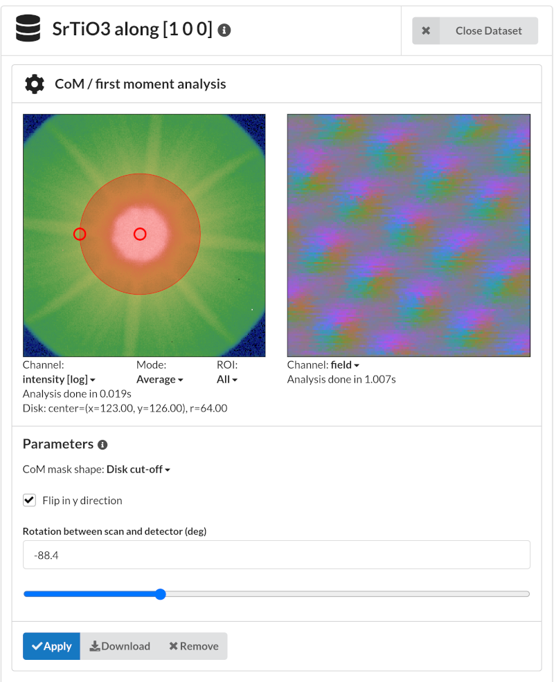

.. `phasecontrast app`:

Phase contrast
==============

Center of mass / first moment
~~~~~~~~~~~~~~~~~~~~~~~~~~~~~

You can get a first moment visualization of your data set by selecting "Center
of mass" in the analysis dropdown:

Take note of the "Channel" drop down, where you can select different
visualizations derived from the vector field.

Ptychographic reconstruction
~~~~~~~~~~~~~~~~~~~~~~~~~~~~

Please see `the ptychography 4.0 project
<https://ptychography-4-0.github.io/ptychography/algorithms.html>`_ for
ptychography algorithms implemented as LiberTEM UDFs.