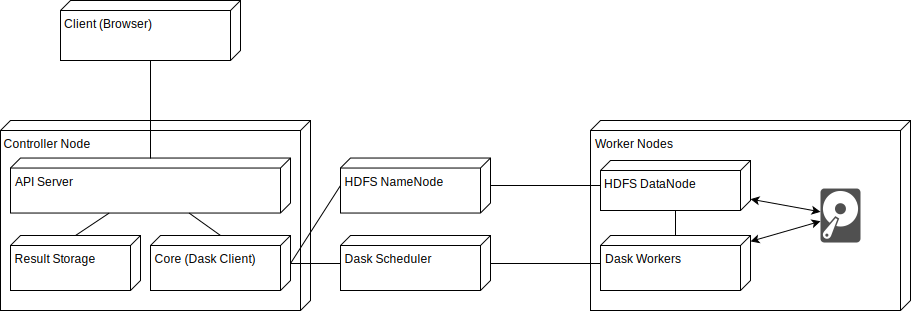
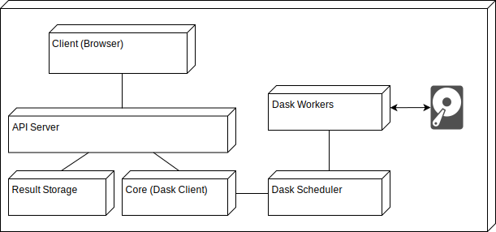

Architecture
============

For the beginning, LiberTEM will focus on pixelated STEM data processing, both
interactive and offline. As concrete supported operations, we will start with
everything that can be expressed as the application of one or more masks and
summation, i.e. virtual detector, center of mass, ...

For our task, data locality is one of the most important factors for achieving
good performance and scalabilty. With a traditional distributed storage
solution (like lustre or NFS), the network will quickly become the bottleneck.
Our new proposal builds on the `Hadoop filesytem (HDFS)`_, which utilizes the
local storage of each compute node. For this, the full dataset needs to be
partitioned and the partitions distributed to the HDFS cluster.

.. _Hadoop filesytem (HDFS): https://hadoop.apache.org/docs/r3.1.0/

When taking care to avoid needless copying and buffering, and using the short
circuit read facilities of HDFS, we can achieve native throughput on each node.
With NVMe SSDs, this means we can process multiple gigabytes per second per node.

For distributing the workload, we plan to use `dask.distributed <http://distributed.readthedocs.io/en/latest/>`_. The `Future` API
allows us to control our computation in a flexible way, with little overhead.
With dask Futures, we can assure that computation on a partition of the dataset
is scheduled on the node(s) that hold the partition on their local storage.

When using HDFS, we cannot operate directly on HDF5 data, as there is no proper
interface for HDF5/HDFS interoperability. Also, we need to partition the source
dataset and distribute it on the HDFS cluster.

That means we need an ingestion process and an intermediate data format. For
now, we want to use raw binary files for their throughput benefits, with
a simple json sidecar file with metadata. Later, something like TileDB on top
of HDFS could work well, especially for applications that have non-linear
access patterns.

For single-node processing, HDFS is uneccessary. We want to allow
a configuration for LiberTEM that works without HDFS and can directly process
data from HDF5-based formats, skipping the ingestion step.

As UI, we plan to develop a web-based interface. This allows LiberTEM to work
in cloud environment as well as locally on a single node. We can benefit from
existing FOSS frameworks and infrastructure for communication, authentication
etc. of the web.

A central part of the architecture is the API server. It is the place through
which the client, Core and storage communicate with each other. It uses
a protocol based on HTTP and/or websockets. The API server is completely
stateless. State is contained in the result storage and Core components. For
example, the browser-based client can receive real-time notifications via
websockets from the computation Core for each part of the computation that has
finished.

The Core is tasked with orchestrating the execution of Jobs, which are
computations on a whole DataSet or on a region of interest. It subdivides Jobs
into smaller Tasks and distributes them on the cluster, or executes them
locally. Our implementation will use dask, so the Core will contain a dask
client, which speaks to the dask scheduler, which itself will speak to dask
workers. In the single node case, the client, scheduler and workers are all
running on the local node.

Processing is done in an asynchronous fashion; if you start a job the request
immediately returns, but you get notifications about status changes, or you can
explicitly query the API server about a specific job.
