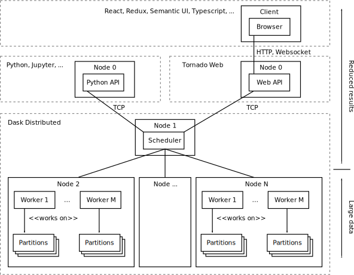

.. _`architecture`:

Architecture
============

LiberTEM currently focuses on pixelated STEM and scanning electron beam
diffraction data processing, both interactive and offline. The processing
back-end supports any n-dimensional binary data. As concrete supported
operations, we started with everything that can be expressed as the application
of one or more masks and summation, i.e. virtual detector, center of mass etc.
These operations are embarrassingly parallel and can be scaled to a distributed
system very well. Furthermore, we support :ref:`user-defined functions` that
process well-defined subsets of a dataset following a simplified `MapReduce
programming model <https://en.wikipedia.org/wiki/MapReduce>`_.

For our task, data locality is one of the most important factors for achieving
good performance and scalability. With a traditional distributed storage
solution (like Lustre or NFS), the network will quickly become the bottleneck.

LiberTEM is distributing the data to the local storage of each compute node. One
possible implementation is using the `Hadoop filesystem (HDFS)`_, although we
are `working on a transparent caching layer
<https://github.com/LiberTEM/LiberTEM/issues/136>`_ as an alternative. The
general idea is to split the dataset into (usually disjoint) partitions, which
are assigned to worker nodes.

The execution is structured into Tasks and Jobs. A Job represents the
computation on a whole dataset, and is divided into Tasks for each partition.
The scheduler executes Tasks on the available worker nodes. For fast execution
on each node, the Task reads the data in small Tiles (~1MB).

For distributing the workload, we are using `dask.distributed
<https://distributed.readthedocs.io/>`_. The `Future` API allows us to control
our computation in a flexible way, with little overhead. With dask Futures, we
can assure that computation on a partition of the dataset is scheduled on the
node(s) that hold the partition on their local storage.

.. _Hadoop filesystem (HDFS): https://hadoop.apache.org/docs/r3.1.0/

For ingesting data into the cluster, a `caching layer
<https://github.com/LiberTEM/LiberTEM/issues/136>`_ (WIP) will transparently
read a dataset from a primary source (via a shared network file system, HTTP,
...) and stores it on fast local storage in a format that is best suited for
efficient processing. The cached data can also be pre-processed, for example for
offset correction or applying a gain map.

An important part of the architecture is the API server. Through the API server,
the client gets access to the resources of the cluster, by running analyses. It
uses a protocol based on HTTP and/or websockets. Processing is initiated by HTTP
calls, and results are streamed back to the browser via web sockets.

The API server keeps some state in memory, like information about the currently
opened datasets. Traditionally this would be done with an external in-memory
database, but for ease of deployment, we decided to integrate this into the API
server.

Processing is done in an asynchronous fashion; if you start an analysis using
the HTTP API, the request immediately returns, but you get notifications about
status changes and results on the websocket channel, or you can explicitly query
the API server about a specific analysis. API calls in the Python API are
synchronous for keeping it easy to use. Please `contact us
<https://gitter.im/LiberTEM/Lobby>`_ or `add a comment to Issue #216
<https://github.com/LiberTEM/LiberTEM/issues/216>`_ if you are interested in an
asynchronous Python API for LiberTEM!

As UI, we use a web-based interface. This allows LiberTEM to work
in cloud environment as well as locally on a single node. We can benefit from
existing FOSS frameworks and infrastructure for communication, authentication
etc. of the web.

LiberTEM is also suited for running on your laptop or workstation. In this case, 
all parts can run on a single node. We can also skip the caching step, if the data
is already available locally.

When taking care to avoid needless copying and buffering, we can achieve native
throughput on each node. With NVMe SSDs, this means we can `process multiple
gigabytes per second per node <performance>`_.

Mathematical expression for applying masks
------------------------------------------

The most basic operation with pixelated STEM data is multiplying each frame
element-wise with a mask of the same size and summing up the result for each
frame. This way one can implement virtual detectors, center of mass and
darkfield imaging, to name a few examples.

Since each frame is processed individually and there's a 1:1 match between 
mask element and detector pixel, the processing can be simplified by
flattening the 4D dataset to a 2D matrix, i.e. a list of vectors where each
vector is one flattened detector frame.
Correspondingly, each mask is flattened to a 1D vector as well.
The result of element-wise  multiplication and summation is a 1D vector for 
each mask, where each entry corresponds to the result of one frame. 
To display the result, the data can be re-shaped to the scan dimension again.

With those extra dimensions flattened, let ``c`` be the number of pixels per
frame, ``n`` the number of frames and ``m`` the number of masks. Let (``A``) be
a ``n x c`` matrix with the scanned data, and ``B`` a ``c x m`` matrix with the
masks. Applying the masks in ``B`` to the detector data in ``A`` can be
expressed as a `rectangular matrix product
<https://en.wikipedia.org/wiki/Matrix_multiplication#Definition>`_ of ``A`` and
``B``.

That means we can use the BLAS function `GEMM
<https://en.wikipedia.org/wiki/Basic_Linear_Algebra_Subprograms#Level_3>`_. to
process the flattened data and we can choose from  wide array of highly
optimized implementations of this operation. LiberTEM supports both dense and
sparse masks (`sparse.pydata.org <https://sparse.pydata.org>`_ and `scipy.sparse
<https://docs.scipy.org/doc/scipy/reference/sparse.html>`_) for this purpose.
This functionality is available through
:meth:`~libertem.udf.masks.ApplyMasksUDF`,
:meth:`~libertem.api.Context.create_mask_analysis` and a number of more
specialized analysis functions in :class:`~libertem.api.Context`.
