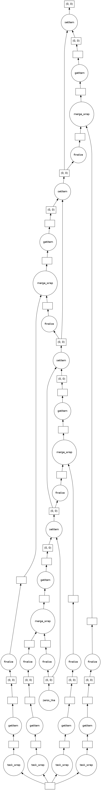

.. note::
    The features described below are experimental and under development.

.. testsetup:: *

    import numpy as np
    
    from libertem.api import Context
    from libertem.executor.inline import InlineJobExecutor

    ctx = Context(executor=InlineJobExecutor())
    dataset = ctx.load("memory", datashape=(16, 16, 16, 16), sig_dims=2)

.. _`dask`:

Dask integration
================

.. versionadded:: 0.9.0

Since version 0.9, LiberTEM supports seamless integration with workflows that
are based on Dask arrays. That means Dask arrays can serve as input for LiberTEM, and
UDF computations can produce Dask arrays. Additionally,
:meth:`~libertem.contrib.daskadapter.make_dask_array` can create Dask arrays from LiberTEM datasets.

Linking with HyperSpy Lazy Signals
----------------------------------

LiberTEM's Dask integration features can be used to combine features from
HyperSpy and LiberTEM in a single analysis workflow:

.. toctree::
   :maxdepth: 2

   hyperspy-integration

.. _`scheduler`:

Scheduler
---------

LiberTEM uses Dask.distributed as the default method to execute tasks.
Unless instructed otherwise, LiberTEM keeps the default Dask scheduler as-is and only
uses the Dask :code:`Client` internally to make sure existing workflows keep running
as before. However, for a closer integration it can be beneficial to use the same scheduler
for both LiberTEM and other Dask computations. There are several options for that:

* Set the LiberTEM Dask cluster as default Dask scheduler:

    * Use :code:`Context.make_with('dask-make-default')` (:meth:`~libertem.api.Context.make_with`)
    * Pass :code:`client_kwargs={'set_as_default': True}` 
      to :meth:`~libertem.executor.dask.DaskJobExecutor.connect` 
      or :meth:`~libertem.executor.dask.DaskJobExecutor.make_local`

* Use an existing Dask scheduler:

    * Use :code:`Context.make_with('dask-integration')` to start 
      an executor that is compatible with the current Dask scheduler.

* Use dask.delayed:

    * :class:`libertem.executor.delayed.DelayedJobExecutor` can 
      return UDF computations as Dask arrays. The scheduler will only be  
      determined when :code:`compute()` is called downstream using the 
      normal mechanisms of Dask.

.. _daskarray:

Load datasets as Dask arrays
----------------------------

The :meth:`~libertem.contrib.daskadapter.make_dask_array` function can generate
a `distributed Dask array <https://docs.dask.org/en/latest/array.html>`_ from a
:class:`~libertem.io.dataset.base.DataSet` using its partitions as blocks. The
typical LiberTEM partition size is close to the optimum size for Dask array
blocks under most circumstances. The dask array is accompanied with a map of
optimal workers. This map should be passed to the :meth:`compute` method in
order to construct the blocks on the workers that have them in local storage.

.. testcode:: make_dask_array

    from libertem.contrib.daskadapter import make_dask_array

    # Construct a Dask array from the dataset
    # The second return value contains information
    # on workers that hold parts of a dataset in local
    # storage to ensure optimal data locality
    dask_array, workers = make_dask_array(dataset)

    result = dask_array.sum(axis=(-1, -2)).compute(workers=workers)

Load Dask arrays as datasets
----------------------------

LiberTEM datasets can be created from Dask arrays by using
:meth:`libertem.api.Context.load` with filetype :code:`'dask'`. See
:ref:`daskds` for details. The performance can vary and depends on chunking,
executor, I/O method and Dask array creation method. Please `contact us
<https://gitter.im/LiberTEM/Lobby>`_ or `create an Issue
<https://github.com/LiberTEM/LiberTEM/issues/new>`_ for questions, bug reports
and other feedback!

This basic example shows running a UDF on a Dask array:

.. testcode:: from_dask

    import dask.array as da
    from libertem.udf.sum import SumUDF

    # Create a Context that integrates well with
    # the current Dask scheduler
    ctx = Context.make_with('dask-integration')

    a = da.random.random((23, 42, 17, 19))
    
    ds = ctx.load('dask', a, sig_dims=2)
    res = ctx.run_udf(dataset=ds, udf=SumUDF())

    assert np.allclose(
        a.sum(axis=(0, 1)).compute(),
        res['intensity'].raw_data
    )

See also :ref:`executors` on how to set up compatible schedulers for
both Dask and LiberTEM.

.. _`delayed_udfs`:

Create Dask arrays with UDFs
----------------------------

Using a :class:`~libertem.executor.delayed.DelayedJobExecutor` with a
:class:`~libertem.api.Context` lets :class:`~libertem.api.Context.run_udf`
return results as Dask arrays.
In addition to the usual :attr:`~libertem.common.buffers.BufferWrapper.data`
and :attr:`~libertem.common.buffers.BufferWrapper.raw_data` properties, which
provide results as numpy arrays eagerly, the results are made available
as dask arrays using the attributes
:attr:`~libertem.executor.utils.dask_buffer.DaskResultBufferWrapper.delayed_data`
and :attr:`~libertem.executor.utils.dask_buffer.DaskResultBufferWrapper.delayed_raw_data`.
The computation is only performed when the
:code:`compute()` method is called on a Dask array result.

.. testcode:: to_dask

    from libertem.api import Context
    from libertem.executor.delayed import DelayedJobExecutor
    
    from libertem.udf.sumsigudf import SumSigUDF

    ctx = Context(executor=DelayedJobExecutor())
    res = ctx.run_udf(dataset=dataset, udf=SumSigUDF())

    print(res['intensity'].delayed_data)

.. testoutput:: to_dask
   
   dask.array<reshape, shape=(16, 16), dtype=float32, chunksize=(..., ...), chunktype=numpy.ndarray>

This method allows to create large intermediate results of :code:`kind='nav'`
efficiently in the form of Dask arrays. The partial results can stay as
ephemeral array chunks on the workers only while they are needed for downstream
calculations instead of transporting them through the cluster and instantiating
the full result on the main node.

For calls to :class:`~libertem.api.Context.run_udf` which run multiple UDFs
or have with UDFs which return multiple results, it is strongly recommended
to compute results with a single call to :code:`compute()`, in order to re-use
computation over the dataset. By default, Dask does not cache intermediate
results from prior runs, so individual calls to :code:`compute()` require
a complete re-run of the UDFs that were passed to :code:`run_udf`.

.. _`merge_all`:

.. _dask merge_all:

Merge function for Dask array results
-------------------------------------

.. note::
    See :ref:`udf merge_all` for more information.

LiberTEM already uses an efficient default merging method to create Dask arrays
for UDFs that only use :code:`kind='nav'` buffers and don't specify their own
:code:`merge()`.

For all UDFs that define their own :code:`merge()`,
:class:`~libertem.executor.delayed.DelayedJobExecutor` will use this
existing :code:`udf.merge()` function to assemble the final results, in the same
way it is used to assemble partial results in each partition. This is carried
out by wrapping the :code:`udf.merge()` in :code:`dask.delayed` calls.

However, the user can also specify a
:meth:`~libertem.udf.base.UDFMergeAllMixin.merge_all()` method on their UDF that
combines all partial results from the workers to the complete result in a single
step. This allows the :class:`~libertem.executor.delayed.DelayedJobExecutor` to
produce a streamlined task tree, which then gives Dask greater scope to
parallelise the merge step and reduce data transfers.

This example shows the task tree first with the built-in wrapper for :code:`udf.merge()`
and then the stramlined one after defining :code:`merge_all()`. In tests the streamlined
variant was twice as fast as the built-in wrapper.

.. testsetup:: merge_all

    import numpy as np
    from libertem.udf.base import UDF
    from libertem.executor.delayed import DelayedJobExecutor

.. testcode:: merge_all

    class MySumUDF(UDF):
        def get_result_buffers(self):
            return {
                'intensity': self.buffer(kind='sig', dtype=self.meta.input_dtype)
            }

        def process_tile(self, tile):
            self.results.intensity[:] += np.sum(tile, axis=0)

        def merge(self, dest, src):
            dest.intensity[:] += src.intensity
    
    ctx = Context(executor=DelayedJobExecutor())
    result = ctx.run_udf(udf=MySumUDF(), dataset=dataset)

    result['intensity'].delayed_data.visualize()

.. testcode:: merge_all

    class MySumMergeUDF(MySumUDF):
        # Define the merge_all() method for the UDF above
        def merge_all(self, ordered_results):
            # List and not generator for NumPy dispatch to work
            chunks = [b.intensity for b in ordered_results.values()]
            # NumPy will dispatch the stacking to the appropriate method
            # for the chunks.
            # See also https://numpy.org/doc/stable/user/basics.dispatch.html
            stack = np.stack(chunks)
            # Perform computation on the stacked chunks
            # equivalent to the normal merge()
            intensity = stack.sum(axis=0)
            
            # Return a dictionary mapping buffer name to new content
            return {'intensity': intensity}
    
    result2 = ctx.run_udf(udf=MySumMergeUDF(), dataset=dataset)

    result2['intensity'].delayed_data.visualize()

.. image:: ./images/tree-merge-all.png
    :width: 300px
    :alt: Task tree with :code:`merge_all()`.

.. testcleanup:: merge_all
    
    assert np.allclose(
        result['intensity'].raw_data,
        result2['intensity'].raw_data,
    )

The argument :code:`ordered_results` is a dictionary of partial results
results for that UDF. The dictionary is keyed by :class:`~libertem.common.slice.Slice`
objects, one for each partition processed, and is ordered in the flat navigation dimension.
Each partial result is itself a dictionary with a key for each result declared in
:code:`udf.get_result_buffers()`. The :code:`ordered_results` dictionary is created
such that the :code:`merge_all` method can safely concatenate the elements in the case
of :code:`'nav'`-shaped results. Any applied ROI is automatically taken into account
after the call to :code:`merge_all`. 

The return value from the function must be a dictionary of merged result arrays
with the keys matching the declared result buffers. There is, however, no requirement
to return merged results for all existing buffers, though any that are missing will not
contain results from the computation and are likely to be filled with zeros.

CUDA and scheduling
-------------------

A native LiberTEM Dask cluster uses resource tags to schedule work on CPUs or
CUDA devices based on an UDF's capability. For Dask integration a fallback was
implemented that allows running computations that can run on a CPU on a native
LiberTEM Dask cluster without requiring resource tags. However, CUDA-only computations
will require passing the appropriate tags as :code:`resources` argument to :code:`compute()`.

:meth:`libertem.executor.delayed.DelayedJobExecutor.get_resources_from_udfs` returns
the appropriate resources for a given set of UDFs based on their capabilities.

.. note::
    At this time the combination of CUDA-requiring UDFs and
    :class:`~libertem.executor.delayed.DelayedJobExecutor` is not well-tested.
    At a minimum, the merge process carried out on the main node
    will not take place with GPU-backed Dask arrays, though this is
    under consideration for the future.
