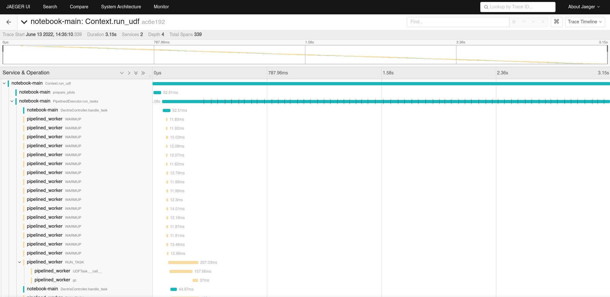

Debugging
=========

.. testsetup:: *

    import numpy as np
    from libertem import api
    from libertem.executor.inline import InlineJobExecutor

    ctx = api.Context(executor=InlineJobExecutor())
    data = np.random.random((16, 16, 32, 32)).astype(np.float32)
    dataset = ctx.load("memory", data=data, sig_dims=2)
    roi = np.random.choice([True, False], dataset.shape.nav)

There are different parts of LiberTEM which can be debugged with different tools and methods.

Debugging the Web GUI
---------------------

For debugging the GUI, you can use all standard debugging tools for web development. Most useful
in this context are the `Chrome DevTools <https://developer.chrome.com/docs/devtools/>`_
or `Firefox Developer Tools <https://developer.mozilla.org/en-US/docs/Tools>`_, which can be
accessed by pressing F12. You can extend these with additional panels
`for React <https://reactjs.org/blog/2019/08/15/new-react-devtools.html>`_
and `for Redux <https://github.com/reduxjs/redux-devtools>`_.

These tools can be used for inspecting all frontend-related processes, from network traffic
up to rendering behavior. Take note of the :code:`/api/events/` websocket connection, where all
asynchronous notification and results will be transferred.

Note that you should always debug using the development build of the GUI, using :code:`npm start`,
as described in :ref:`the contributing section <building the client>`. Otherwise the debugging
experience may be painful, for example worse error output from react, minified source and
minified component names, ...

Debugging the API server
------------------------

If the API server returns a server error (500), the detailed exception should be logged
in the output of :code:`libertem-server`. You can also try
`enabling the debug mode of tornado <https://www.tornadoweb.org/en/stable/guide/running.html#debug-mode-and-automatic-reloading>`_
(there is currently no command line flag for this, so you need to change
:py:mod:`libertem.web.server` accordingly.)

If an analysis based on the exception alone is inconclusive,
you can try to reproduce the problem using the Python API and follow the instructions below.

.. _`debugging udfs`:

Debugging UDFs or other Python code
-----------------------------------

If you are trying to write a UDF, or debug other Python parts of LiberTEM, you can
instruct LiberTEM to use simple single-threaded execution using the
:class:`~libertem.executor.inline.InlineJobExecutor`.

.. testsetup::

    from libertem.udf.logsum import LogsumUDF

    udf = LogsumUDF()

.. testcode::

   from libertem.executor.inline import InlineJobExecutor
   from libertem import api as lt

   ctx = lt.Context(executor=InlineJobExecutor())

   ctx.run_udf(dataset=dataset, udf=udf)

You can then use all usual debugging facilities, including
`pdb <https://docs.python.org/3.7/library/pdb.html>`_ and
`the %pdb magic of ipython/Jupyter <https://ipython.org/ipython-doc/3/interactive/magics.html#magic-pdb>`_.

The :class:`libertem.executor.inline.InlineJobExecutor` uses a single CPU core
by default. It can be switched to GPU processing to test CuPy-enabled UDFs by
calling :meth:`libertem.common.backend.set_use_cuda` with the device ID to use.
:code:`libertem.common.backend.set_use_cpu(0)` switches back to CPU processing.

.. testsetup::

    from libertem.udf.masks import ApplyMasksUDF

    udf = ApplyMasksUDF(mask_factories=[lambda:np.ones(dataset.shape.sig)])

.. testcode::

   from libertem.executor.inline import InlineJobExecutor
   from libertem import api as lt
   from libertem.utils.devices import detect
   from libertem.common.backend import set_use_cpu, set_use_cuda

   ctx = lt.Context(executor=InlineJobExecutor())

   d = detect()
   if d['cudas'] and d['has_cupy']:
       set_use_cuda(d['cudas'][0])
   ctx.run_udf(dataset=dataset, udf=udf)
   set_use_cpu(0)

If a problem is only reproducible using the default executor, you will have to follow the
`debugging instructions of dask-distributed <https://docs.dask.org/en/latest/debugging.html>`_.
As the API server can't use the synchronous :class:`~libertem.executor.inline.InlineJobExecutor`,
this is also the case when debugging problems that only occur in context of the API server.

Debugging failing test cases
----------------------------

When a test case fails, there are some options to find the root cause:

The :code:`--pdb` command line switch of pytest can be used to automatically
drop you into a PDB prompt in the failing test case, where you will either land
on the failing :code:`assert` statement, or the place in the code where an
exception was raised.

This does not help if the test case only fails in CI. Here, it may be easier to
use logging. Because we call pytest with the :code:`--log-level=DEBUG`
parameter, the failing test case output will have a section containing the
captured logging output.

You can sprinkle the code with `log.debug(...)` calls that output the relevant
variables. In some cases you may also leave the logging statements in the code
even after the problem is fixed, depending on the overhead.

Tracing using opentelemetry
---------------------------

.. versionadded:: 0.10.0
    Tracing support using opentelemetry was added in version 0.10.0

Instead of sprinkling logging or print statements into your code,
it is also possible to diagnose issues or gain insight into the runtime
behavior of LiberTEM using opentelemetry tracing. This is also based on
adding instrumentation to the code, but follows a more structured approach.

Using tracing, instead of relatively unstructured "log lines",
rich and structured information can be logged as traces, which are organized
into spans. These traces can then be visualized, inspected, searched, ...
using different tools and databases, here for example using
`Jaeger <https://www.jaegertracing.io/>`_:

This becomes more interesting once your code goes beyond a single thread or
process, when it is important to see the temporal relation between different
events and functions executing concurrently. Crucially, it is possible to
gather traces in distributed systems, from different nodes.

For an overview of opentelemetry, please see `the official opentelemetry documentation
<https://opentelemetry.io/docs/reference/specification/overview/>`_ - here, we
will document the practical setup and usage. For the Python API docs, please
see the `opentelemetry Python API docs <https://opentelemetry-python.readthedocs.io/en/latest/>`_.

Getting tracing running
~~~~~~~~~~~~~~~~~~~~~~~

Some external services are needed to gather traces. We include
:code:`docker-compose` configuration for getting these up and running quickly
in the :code:`tracing` directory. Please note that this configuration
by default opens some ports, so be careful, as this may circumvent your
device's firewall!

To get these running, start :code:`docker-compose up` in said directory. This will
pull in all required docker images and start the required services, until they
are stopped using :code:`Ctrl+C`.

The Jaeger UI, as shown above, is then available on `localhost:16686
<http://localhost:16686>`_. An alternative UI, called Zipkin, is available on
`localhost:9411 <http://localhost:9411>`_. Both of these should now be viewable
by your browser.
The actual trace collection API endpoint is started on port 4317, but is only
used under the hood.

In your LiberTEM virtual environment, you need to install the :code:`tracing`
extra, for example via :code:`pip install -e .[tracing]`.

The Python code then needs to be told to enable tracing, and how to connect to
the trace collection API endpoint. The easiest way is to set environment variables,
for example, in a notebook:

.. code:: python

    %env OTEL_ENABLE=1
    %env OTEL_EXPORTER_OTLP_ENDPOINT=http://localhost:4317

    from libertem.common.tracing import maybe_setup_tracing
    maybe_setup_tracing(service_name="notebook-main")

Or, for intrumenting the :code:`libertem-server`:

.. code:: bash

    OTEL_ENABLE=1 OTEL_EXPORTER_OTLP_ENDPOINT=http://localhost:4317 libertem-server

The same works for bringing up :code:`libertem-worker` processes:

.. code:: bash

    OTEL_ENABLE=1 OTEL_EXPORTER_OTLP_ENDPOINT=http://localhost:4317 libertem-worker

Be sure to change the endpoint URL to whatever is the correct one from the
perspective of the worker process in the distributed case.

For enabling tracing across multiple Python processes, possibly on multiple
nodes, set the environment variables for each of these processes, and also call
the :func:`~libertem.common.tracing.maybe_setup_tracing` function on each.
If these are workers managed by an executor, you can use the :code:`run_each_worker`
method to accomplish this:

.. code:: python

    from libertem.common.tracing import maybe_setup_tracing
    from libertem.api import Context
    ctx = Context()
    ctx.executor.run_each_worker(maybe_setup_tracing, service_name="libertem-worker")

Support for setting up tracing on workers automatically is already integrated
in the dask and pipelined executors. The inline executor doesn't need any
additional setup for tracing to work.

On Windows
~~~~~~~~~~

The easiest way to get the tracing services up and running is using
`Windows Subsystem for Linux <https://docs.microsoft.com/en-us/windows/wsl/install>`_
to install Linux and Docker. This allows to run the tracing services as described above.
Alternatively, `Docker Desktop for Windows <https://docs.docker.com/desktop/windows/install/>`_
could be an option.

Clients running natively on Windows can then connect to these services:

.. code:: bat

    set OTEL_ENABLE=1
    set OTEL_EXPORTER_OTLP_ENDPOINT=http://localhost:4317
    libertem-server

Adding your own instrumentation
~~~~~~~~~~~~~~~~~~~~~~~~~~~~~~~

By default, a minimal set of functions is already annotated with tracing
information, to be able to understand how UDFs are executed across multiple
processes. Adding tracing instrumentation to your code is similar to setting
up logging using the :code:`logging` module. At the top of your Python module,
you create and use a :code:`Tracer` object like this:

.. testsetup:: tracing

    import time
    from opentelemetry import trace
    tracer = trace.get_tracer(__name__)

.. testsetup:: nosetup
    
    pass

.. testcode:: nosetup

    import time
    from opentelemetry import trace

    tracer = trace.get_tracer(__name__)

    def some_function():
        with tracer.start_as_current_span("span-name"):
            time.sleep(0.1)  # do some real work here

    some_function()

You can also add some more information to a span, for example events with attributes:

.. testcode:: tracing

    def some_function():
        with tracer.start_as_current_span("span-name") as span:
            for i in range(16):
                time.sleep(0.1)  # do some real work here
                span.add_event(f"work item done", {
                    "item_id": i,  # you can add attributes to events
                })

    some_function()

Attributes can also be added to spans themselves:

.. testcode:: tracing

    def some_function():
        with tracer.start_as_current_span("span-name") as span:
            time.sleep(0.1)  # do some real work here
            span.set_attributes({
                "attribute-name": "attribute-value-here",
            })

    some_function()

Note that, while the tracing is quite lightweight, it is probably a good idea
to not add spans and events in the innermost loops of your processing, like
:code:`UDF.process_frame`, but spans for per-partition operations
should be fine. In the future, metrics could also be collected to gain
further insight into the performance characteristics.

For more details, please also see the `opentelemetry Python API docs <https://opentelemetry-python.readthedocs.io/en/latest/>`_.
