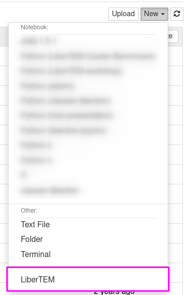
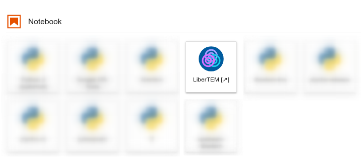

.. _`jupyter integration`:

Jupyter integration
===================

.. versionadded:: 0.8.0

The web-based LiberTEM GUI can be integrated into existing JupyterLab and
JupyterHub installations. That way, the existing authentication and user
management infrastructure of Jupyter can be re-used to offer LiberTEM as
a service. The LiberTEM GUI will have access to the same data that is available
to Jupyter notebooks.

.. note::

    Currently, Jupyter integration is only supported on Unix, not on Windows
    because of outstanding issues in some dependencies. See `simpervisor/6
    <https://github.com/jupyterhub/simpervisor/issues/6>`_ and
    `jupyter-server-proxy/181
    <https://github.com/jupyterhub/jupyter-server-proxy/pull/181>`_ for more
    details.

Installation
------------

.. note::

    Currently, a fork of :code:`jupyter-server-proxy` needs to be used, which
    includes a fix to allow restarting LiberTEM after a graceful shutdown, see
    also
    `jupyter-server-proxy/215
    <https://github.com/jupyterhub/jupyter-server-proxy/pull/215>`_. 
    The fork also includes other unreleased but necessary changes from the
    master branch of :code:`jupyter-server-proxy`.
    Installation can be done with the following commands, after having followed
    the installation instructions below:

    .. code-block:: shell
        
        (jupyter-venv) $ git clone git@github.com:sk1p/jupyter-server-proxy.git
        (jupyter-venv) $ cd jupyter-server-proxy && git checkout websocket-fix-plus-restart
        (jupyter-venv) $ pip install .

    Note that this needs to be done in the environment where 
    :code:`libertem-jupyter-proxy` was installed.

As a first step, you will need to install
`LiberTEM-jupyter-proxy <https://github.com/LiberTEM/LiberTEM-jupyter-proxy>`_
into the Python environment where JupyterHub or JupyterLab is installed. Then,
you will also need an installation of LiberTEM, which can live in either the same
Python environment, or in its own.

In case of a separate Python environment for LiberTEM, you will need to tell
LiberTEM-jupyter-proxy how to start the :code:`libertem-server`. This is done
with a simple JSON configuration file. The configuration file needs to be saved in the
Python environment where LiberTEM-jupyter-proxy is installed. If the virtualenv
that contains the Jupyter installation is created at
:code:`/opt/jupyter/venv/`, the configuration filename should be
:code:`/opt/jupyter/venv/etc/libertem_jupyter_proxy.json`. The contents should
look like this:

.. code-block:: json

   {"libertem_server_path": "/opt/libertem/venv/bin/libertem-server"}

This allows to separate the Jupyter installation from the LiberTEM installation.
The given path can also point to a wrapper script, for example for further environment
preparations, like loading modules on an HPC system. The wrapper script should forward
any arguments it reveices to the :code:`libertem-server` call.

Usage
-----

When the installation is finished, you can find the LiberTEM GUI as an entry
in the :code:`New` menu in JupyterHub:

Or as a launcher icon in JupyterLab:

