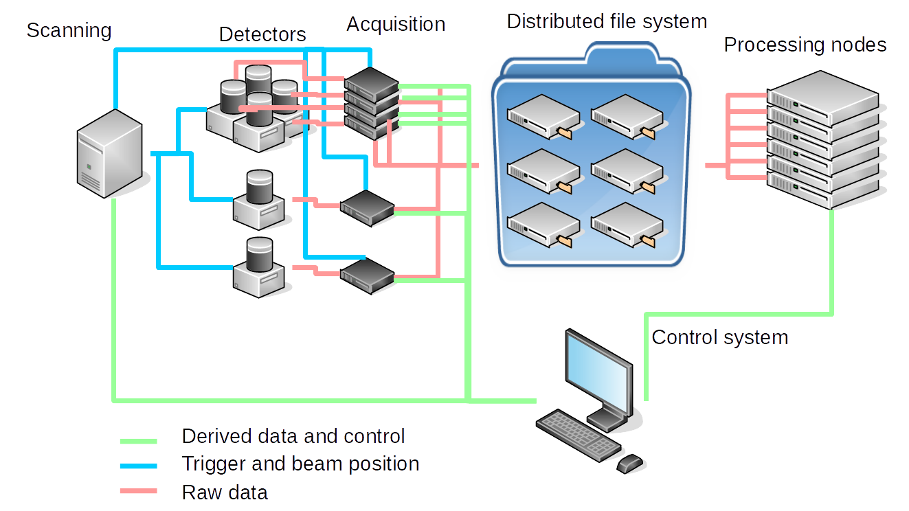

GSoC 2020 ideas
===============

LiberTEM is participating in the `Google Summer of Code
<https://summerofcode.withgoogle.com/>`_ as a sub-organization of the `Python
Software Foundation <https://python-gsoc.org/>`_. As a student, you can get paid
by Google for three months, have fun working on an interesting open source
software project, gain real-world development experience, and do something that
looks nice on your CV!

* Check out our description and project ideas below
* Contact us if you'd like to work on LiberTEM
* Prepare a `proposal <https://python-gsoc.org/index.html#apply>`_ together with us
* You submit your application at the Google Summer of Code homepage to the Python
  Software Foundation organization, naming LiberTEM as the sub-organization.

Why LiberTEM
--------------

`LiberTEM <.>`_ is an open source platform for high-throughput distributed
processing of pixelated scanning transmission electron microscopy (STEM) data.
It is created to deal with the terabytes of data that modern high-speed
high-resolution detectors for electron microscopy can produce. Our
:doc:`architecture` page describes in more detail how exactly it works.

..  figure:: ./images/Principle.png
    :scale: 50%
    :alt: In pixelated STEM, a full diffraction image is recorded for each scan position.

    *In pixelated STEM, a sample is scanned with a focused electron beam, and a
    full image of the transmitted beam is recorded for each scan position. The
    result is a four-dimensional data hypercube. This application can generate
    tremendous amounts of data from high-resolution scans with a high-speed
    high-resolution detector.*

The project started in the beginning of 2018 and is currently attracting more
and more users because it is orders of magnitude faster and more scalable than
established solutions.

Working on LiberTEM will give you experience in developing distributed systems
for high-performance data processing with Python. You can learn how to profile
an application and optimize performance in a targeted way. See
:ref:`performance` for benchmarking results. LiberTEM has its roots in electron
microscopy, but can be adopted for other tasks that involve high-throughput
data-parallel processing of very large binary data sets.

    *LiberTEM currently implements distributed offline data processing as shown
    on the right of this figure, and is designed to be extended to
    high-throughput distributed live data processing as illustrated on the
    left.*

If you work on our GUI, you'll learn how a responsive web application for big
data analytics can be built with a front-end based on TypeScript, React and
Redux, and an asynchronous Python back-end based on Tornado and
dask.distributed.

Working on the application side will give you experience in Python-based big
data analytics of large-scale binary data sets with a focus on imaging, physics
and materials science with industry-leading throughput and efficiency.

About us
--------

Alex is an experienced software engineer, systems administrator, Python
programmer, web developer, and expert on profiling and performance optimization.
He focuses on the implementation side of LiberTEM. 

* https://github.com/sk1p

Dieter has an interdisciplinary background in materials science, computer
science, product development, product management and business administration. He
is taking care of the application and business side of LiberTEM. 

* https://github.com/uellue
* https://www.facebook.com/uellue
* https://www.linkedin.com/in/uellue/

We'd be happy to share our experience with you!

How to reach us
---------------

The easiest path is our Gitter channel: https://gitter.im/LiberTEM/Lobby

E-Mail: `Dieter Weber <mailto:d.weber@fz-juelich.de>`_ `Alexander Clausen
<mailto:a.clausen@fz-juelich.de>`_

Just drop a message! We are based in Germany (UTC+1 / UTC+2) and are generally
active during normal working hours.

Getting started
---------------

If you have questions, please ask freely: Supporting users and contributors has
a high priority for us and your questions help us improve our documentation.

Installation
~~~~~~~~~~~~

Please see our :ref:`installation` instructions for details! Forking our
repository, cloning the fork and :ref:`installing from a git clone` are the
recommended setup if you will be contributing significant amounts of code. Our
:ref:`contributing` page has some information that can
help you get started with development.

Currently, we are still working on getting suitable sample files online. Please
contact us to get interesting sample data to work on!

What to work on
~~~~~~~~~~~~~~~

Our `issue tracker can give you a broad overview
<https://github.com/LiberTEM/LiberTEM/issues>`_ of what we have on our plate.
We've marked a number of `Good first issues
<https://github.com/LiberTEM/LiberTEM/issues?q=is%3Aissue+is%3Aopen+label%3A%22good+first+issue%22>`_
that might be relatively easy to solve and can help you get introduced to our
code base. Further below we list a few specific ideas.

Writing your GSoC application
-----------------------------

The PYTHON GSOC website has a good overview for the application process:
https://python-gsoc.org/index.html#apply https://python-gsoc.org/students.html
with links to additional resources. Please remember to name the sub-organization
*LiberTEM* in your proposal!

To get an inspiration on how to write your application, `Mailman
<https://turnbull.sk.tsukuba.ac.jp/Blog/SPAM.txt>`_ gives a few general ideas.
For us it is most important to know why you'd like to contribute to LiberTEM,
what your experience level is and what you'd like to learn in order to find a
good match for a project. Generally, we like targeted applications and
applicants who contact us directly early-on. We are happy to work with you for
writing up a project idea!

For Python GSoC it is a general requirement to already contribute a pull request
to a sub-organization before submitting a project idea. Please contact us if
you'd like some help with that! `Improving our examples
<https://github.com/LiberTEM/LiberTEM/tree/master/examples>`_ in code,
description and presentation would be both relatively easy and quite useful for
us. You could perform the update with our help, hunt
down discrepancies and suggest improvements. Please contact us for the
corresponding data to run the examples!

Other small and relatively straightforward issues include :issue:`81,267,506`

Project ideas
-------------

These are somewhat larger work items. Some of them can keep you busy for the
entire time. Please feel free to suggest your own ideas as well! Just working on
a number of smaller features and getting a good cross-sectional experience of
LiberTEM can work as well.

1. **Beginner**: Implement rotation in GUI and back-end for center of mass analysis :issue:`31`.
    Currently, the implementation assumes that the detector edges are parallel
    to the sample X and Y coordinate directions. This is mostly, but not always
    the case. In this project you implement an additional parameter for rotation
    both in the back-end and GUI. That includes a discussion with users of the
    center of mask analysis on how to determine and verify this parameter and
    what the interface should be like.

    *Skills:* Communication, Python, NumPy and TypeScript programming, simple
    web GUI development.

    *Domain knowledge:* simple linear algebra, basic optics.

    *Primary contact:* Dieter (@uellue)

2. **Beginner**: Code snippet for analysis in GUI :issue:`158`.
    Currently, our GUI only offers limited capabilities. Most notably, color
    scale, scale bars and exporting results are not implemented. In this
    project, you implement functions that generate a code snippet in the GUI
    ready for copy & paste. Pasting this snippet in, for example, a Jupyter
    notebook allows to use the analysis with the same parameters as in the GUI
    in a scripting environment that gives users more flexibility.

    *Skills:* Python

    *Domain knowledge:* Learning some LiberTEM basics

    *Primary contact:* Dieter (@uellue), Alex (@sk1p)

3. **Intermediate**: Implement an analysis workflow for `RDF mapping <https://publikationen.bibliothek.kit.edu/1000056485/5249497>`_.
    This can give you experience with the product development, design and
    application side of software engineering, and applied data science. A major
    part of the work is first figuring out *what* to implement together with our
    users and domain experts, and then *how* to implement it. You can decide how
    far you take it: A detailed requirements document, a technical
    specification, a prototype, or a full production-grade implementation? All
    of that is useful for us.

    *Skills:* Communication, software development methodology, Python and NumPy programming.
    
    *Domain knowledge:* Math, statistics, image processing and physics are of advantage.

    *Primary contact:* Dieter (@uellue)

4. **Intermediate**: Allow reshaping datasets into a custom shape :issue:`441`.
    Data in files is not always stored in the native shape, or different
    representations may be possible depending on the application. The dataset
    implementation and GUI should allow specifying a different shape than the
    layout in the dataset.

    *Skills:* Python, NumPy and TypeScript programming.

    *Domain knowledge:* None

    *Primary contact:* Alex (@sk1p)

5. (*Removed since being implemented*: Set number of threads and workers dynamically for UDFs :issue:`546`.)

6. **Beginner/Intermediate/Advanced**: Compression survey :issue:`387`.
    Analyze high-throughput compression techniques, dive into lz4/zstd, blosc
    etc., compare against existing file formats.
    
    *Beginner level*: Test a number of established compression algorithms on typical
    data sets in terms of compression ratio, compression speed and decompression speed.

    *Intermediate level*: Implement the compression in the LiberTEM caching layer.

    *Advanced*: Explore your own ideas regarding compression.

    With this project you can improve your understanding of compression
    techniques for the easier levels, and low-level optimization and programming
    for the advanced level.

    *Skills:* Programming in Python, profiling. C or Numba programming for advanced level.
    
    *Domain knowledge:* Good understanding of computer architecture for the advanced level.

    *Contact:* Dieter (@uellue), Alex (@sk1p)

7. **Intermediate**: Explore automated benchmarks in detail :issue:`198`.
    This will help us to catch performance regressions. In our experience,
    running a benchmark requires a reproducible, undisturbed environment and
    comparison to good reference data. For that reason we see it as more
    challenging than automated tests for functionality and correctness. You
    could run benchmarks in CI and observe variance, and record and present
    benchmark results over time.

    *Skills:* Programming, profiling, visualization.
    
    *Domain knowledge:* Continuous integration and automation tools.

    *Primary contact:* Alex (@sk1p)

8. **Intermediate**: Editor for masks :issue:`47`.
    Currently, the masks in the GUI are limited to a few simple shapes, while
    the back-end allows arbitrary masks. You could implement an online mask
    editor to give users more flexibility on designing masks. Part of the task
    would be a requirements analysis with experts for the scientific
    application, and an analysis if any existing code like
    https://react-designer.github.io/react-designer/
    https://two.js.org/examples/ or http://fabricjs.com/controls-customization
    can possibly be used. This project would be mostly implemented in
    TypeScript.

    *Skills:* Programming in TypeScript, GUI development, basic computer graphics knowledge.
    
    *Domain knowledge:* --

    *Contact:* Dieter (@uellue), Alex (@sk1p)

9. **Intermediate**: Deploy LiberTEM with kubernetes :issue:`105,484`.
    Help us set up a helm chart and documentation to deploy a LiberTEM cluster
    with kubernetes. The subject is fairly new to us and we'd appreciate your
    help, in particular if you already have experience with kubernetes.

    *Skills:* Systems administration and automation.
    
    *Domain knowledge:* kubernetes

    *Primary contact:* Alex (@sk1p)

10. **Intermediate/Advanced**: Proper schemas, validation and automatic form generation for analysis parameters :issue:`316`.
     This feature will make it easier to implement new types of analysis in the
     GUI. This is a cross-section through Python and TypeScript, though we could
     also split off the more react-y part. Does not require NumPy knowledge, or
     domain knowledge. Python/TypeScript required. General WebDev experience
     could help.

     *Skills:* Systematic thinking and abstraction, Python and TypeScript programming, web development.

     *Domain knowledge:* --

     *Primary contact:* Alex (@sk1p)

11. **Intermediate/Advanced**: Custom math kernel for bit masks :issue:`26`.
     Currently, binary masks are first converted to floating point and then used
     in a dot product. NumPy uses GEMM from a third-party BLAS implementation for
     this. This could be accelerated significantly with a Numba-based custom GEMM
     implementation that can work on bit masks directly. Furthermore, such a
     custom Numba-based GEMM kernel has potential other uses in LiberTEM:
     :issue:`555`.

     *Skills:* Python, Numba

     *Domain knowledge:* Optimization, efficient matrix product implementations.

     *Contact:* Dieter (@uellue), Alex (@sk1p)

12. **Advanced**: Live visualization of large binary data :issue:`134`.
     Basically an efficient/zoomable/user-friendly/fully-featured replacement for
     our visualization. Requires a cross-section of different technologies from
     Python/numpy/threading over HTTP/websockets to Canvas/WebGL. Could be spun
     off into its own project if it is successful! This is a larger project that
     can be split into smaller individual parts. If you are interested, we should
     discuss about setting a scope that suits your interests.

     *Skills:* Python and TypeScript programming, web development, asynchronous
     and parallel programming, numerical processing, visualization.
    
     *Domain knowledge:* Experience with similar projects and frameworks like for
     example `GR <https://gr-framework.org/>`_ desirable. Knowledge of `GIS
     <https://en.wikipedia.org/wiki/Geographic_information_system>`_ could
     potentially be useful.

     *Contact:* Dieter (@uellue), Alex (@sk1p)

13. **Advanced**: Enable user-defined functions based on WebAssembly :issue:`199`.
     This would allow users to write user-defined functions in their favorite
     compiled language and is a step towards using LiberTEM independent of
     Python.

     *Skills:* Python and compiled languages.
    
     *Domain knowledge:* Experience with WebAssembly would be useful.

     *Contact:* Dieter (@uellue), Alex (@sk1p)

