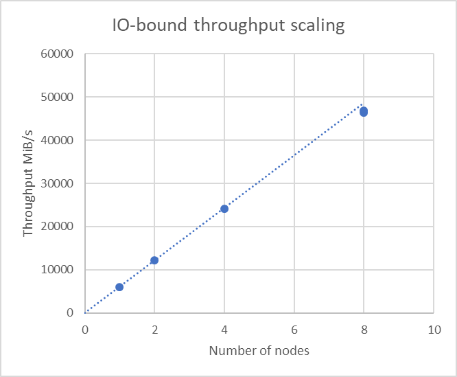
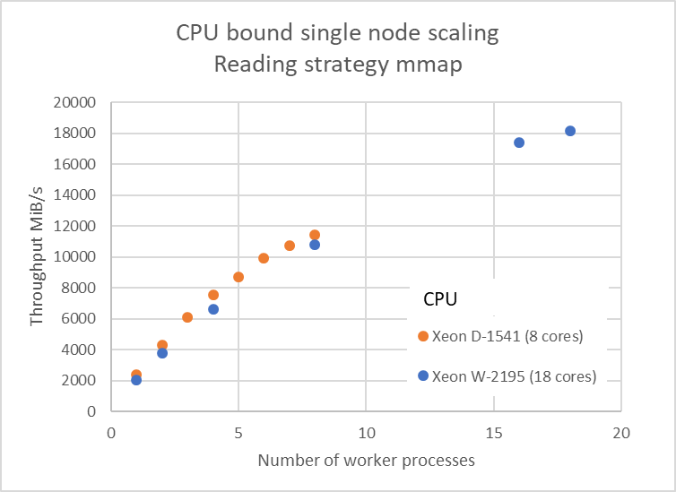

.. _`performance`:

Performance
===========

LiberTEM is designed and optimized for very high throughput in order to process large-scale datasets with fast turn-around. 

    Near linear throughput scaling with the number of nodes for an IO-bound virtual detector calculation on a 480 GiB file using direct IO on Supermicro Microcloud 5038MD-H8TRF, Intel(R) Xeon(R) CPU D-1541 @ 2.10GHz, Intel Ethernet Controller 10G X550T, RAID 0 of 2x Samsung SSD 970 EVO 2TB, 32 GB RAM, cluster head node with Intel(R)Xeon(R) W-2195 CPU @ 2.30GHz.

    Benchmark results performing a CPU-bound virtual detector calculation using memory-mapped IO on files in the file system cache.
