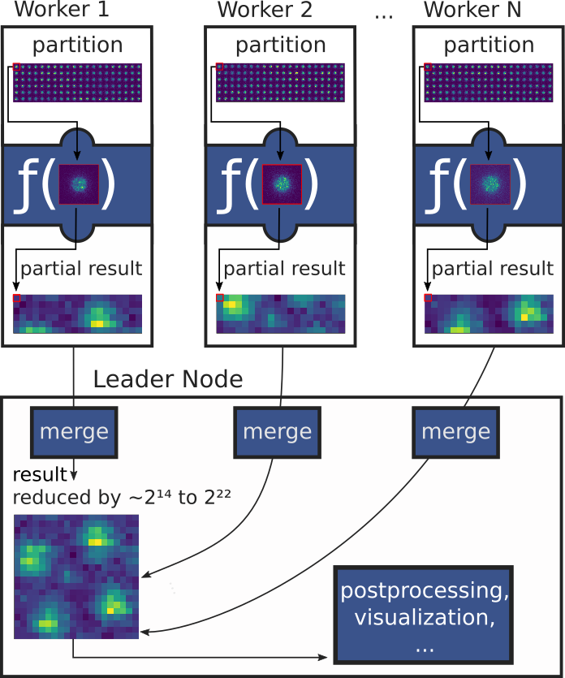

.. _`user-defined functions`:

User-defined functions
======================

.. testsetup:: *

   import numpy as np
   from libertem import api
   from libertem.executor.inline import InlineJobExecutor

   from libertem.udf import UDF as RealUDF

   # We override UDF in such a way that it can be used
   # without implementing all methods
   class UDF(RealUDF):
      def get_result_buffers(self):
         return {}

      def process_frame(self, frame):
         pass

   class YourUDF(RealUDF):
      def get_result_buffers(self):
         return {'buf1': self.buffer(kind="nav")}

      def process_frame(self, frame):
         self.results.buf1[:] = 42

   ctx = api.Context(executor=InlineJobExecutor())
   data = np.random.random((16, 16, 32, 32)).astype(np.float32)
   dataset = ctx.load("memory", data=data, sig_dims=2)
   roi = np.random.choice([True, False], dataset.shape.nav)
   udf = YourUDF()

A common case for analyzing big EM data sets is running a reduction operation
on each individual detector frame or other small subsets of a data set and then
combining the results of these reductions to form the complete result. This should
cover a wide range of use cases, from simple mathematical operations, for
example statistics, to complex image processing and analysis, like feature extraction.

The user-defined functions (UDF) interface of LiberTEM allows you to run your
own reduction functions easily, without having to worry about parallelizing,
I/O, the details of buffer management and so on. This corresponds to
a simplified `MapReduce programming model <https://en.wikipedia.org/wiki/MapReduce>`_,
where the intermediate re-keying and shuffling step is omitted.

It can be helpful to review :ref:`some general concepts <concepts>` before
reading the following sections.

Getting started
---------------

The easiest way of running a function over your data is using the 
:meth:`~libertem.api.Context.map` method of the LiberTEM API.

For example, to calculate the sum over the last signal axis:

.. testcode:: autoudf

   import functools
   import numpy as np

   result = ctx.map(
      dataset=dataset,
      f=functools.partial(np.sum, axis=-1)
   )
   # access the result as NumPy array:
   np.array(result)
   # or, alternatively:
   result.data

The function specified via the :code:`f` parameter is called for each frame / diffraction pattern.

See :ref:`auto UDF` for details. This is most suited for simple functions; once you have
parameters or want to re-use some data across function calls, you should create a
:class:`~libertem.udf.UDF` subclass instead.

.. _`how UDFs work`:

How UDFs works
--------------

To allow for parallel processing, data is first divided into partitions along the navigation axes,
which are worked on by different worker processes. Then, for each frame of a partition, a
user-defined function :meth:`~libertem.udf.UDFFrameMixin.process_frame` is called,
which is free to do any imaginable processing.

As a result of splitting the data set into partitions, the results then need to be merged
back together. This is accomplished by calling the :meth:`~libertem.udf.UDF.merge` method
after all frames of a partition are processed.

In pseudocode, data is processed in the following way:

.. code-block:: python

   result = empty
   for partition in get_partitions(dataset):
      partition_result = empty
      for frame, frame_slice in get_frames(partition):
         frame_result = process_frame(frame)
         partition_result[frame_slice] = frame_result
      merge(dest=result, src=partition_result)

In reality, the loop over partitions is run in parallel using multiple worker processes,
potentially :ref:`on multiple computers <architecture>`. The loop over individual frames is
run in the worker processes, and the merge function is run in the main process, accumulating the
results, every time the results for a partition are available. 

In addition to :meth:`~libertem.udf.UDFFrameMixin.process_frame`, there are two more methods
available for overriding, to work on larger/different units of data at the same time:
:meth:`~libertem.udf.UDFTileMixin.process_tile`
and :meth:`~libertem.udf.UDFPartitionMixin.process_partition`. They can be used for optimizing
some operations, and are documented in the :ref:`advanced topics <advanced udf>` section.

Implementing a UDF
------------------

The workflow for implementing a UDF starts with subclassing
:class:`~libertem.udf.UDF`. In the simplest case, you need to implement the
:meth:`~libertem.udf.UDF.get_result_buffers` method and 
:meth:`~libertem.udf.UDFFrameMixin.process_frame`.

There are two very common patterns for reductions, reducing over the navigation axes
into a common accumulator for all frames, keeping the shape of a single frame,
or reducing over the signal axes and keeping the navigation axes.

A UDF can implement one of these reductions or combinations. To handle indexing for you,
LiberTEM needs to know about the structure of your reduction. You can build this structure in the
:meth:`~libertem.udf.UDF.get_result_buffers` method, by declaring one or more buffers.

Declaring buffers
~~~~~~~~~~~~~~~~~

These buffers can have a :code:`kind` declared, which corresponds to the two reduction patterns above:
:code:`kind="sig"` for reducing over the navigation axes (and keeping the signal axes), and 
:code:`kind="nav"` for reducing over the signal axes and keeping the navigation axes. There is a
third, :code:`kind="single"`, which stores just a single value.

It is also possible to append new axes to the end of the buffer using the
:code:`extra_shape` parameter.

:meth:`~libertem.udf.UDF.get_result_buffers` should return a :code:`dict` which maps
buffer names to buffer declarations. You can create a buffer declaration by calling
the :meth:`~libertem.udf.UDF.buffer` method.

The buffer name is later used to access the buffer via :code:`self.results.<buffername>`,
which returns a view into a NumPy array. For this to work, the name has to be a valid Python
identifier.

Examples of buffer declarations:

.. testcode:: getresultbuffers

   def get_result_buffers(self):
      # Suppose our dataset has the shape (14, 14, 32, 32),
      # where the first two dimensions represent the navigation
      # dimension and the last two dimensions represent the signal
      # dimension.

      buffers = {
         # same shape as navigation dimensions of dataset, plus two
         # extra dimensions of shape (3, 2). The full shape is
         # (14, 14, 3, 2) in this example. This means this buffer can
         # store an array of shape (3, 2) for each frame in the dataset.
         "nav_buffer": self.buffer(
               kind="nav",
               extra_shape=(3, 2),
               dtype="float32",
         ),

         # same shape as signal dimensions of dataset, plus an extra
         # dimension of shape (2,). Consequently, the full shape is
         # (32, 32, 2) in this example. That means we can store two
         # float32 values for each pixel of the signal dimensions.
         "sig_buffer": self.buffer(
               kind="sig",
               extra_shape=(2,),
               dtype="float32",
         ),

         # buffer of shape (16, 16); shape is unrelated to dataset shape
         "single_buffer": self.buffer(
               kind="single",
               extra_shape=(16, 16),
               dtype="float32",
         ),

      }

      return buffers

.. testcleanup:: getresultbuffers

   class TestUDF(UDF):
      pass

   TestUDF.get_result_buffers = get_result_buffers

   u = TestUDF()
   ctx.run_udf(dataset=dataset, udf=u)

See below for some more real-world examples.

All NumPy dtypes are supported for buffers. That includes the :code:`object`
dtype for arbitrary Python variables. The item just has to be pickleable with
:code:`cloudpickle`.

Note that buffers are only designed to pass lightweight intermediate results
and thus, it is important that the size of the buffer remains small. Having too
large buffers can lead to significant decline in performance.

Implementing the processing function
~~~~~~~~~~~~~~~~~~~~~~~~~~~~~~~~~~~~

Now to the actual core of the processing: implementing
:meth:`~libertem.udf.UDFFrameMixin.process_frame`. The method signature looks like this:

.. testcode:: processing

   class ExampleUDF(UDF):
      def process_frame(self, frame):
         pass

.. testcleanup:: processing

   u = ExampleUDF()
   ctx.run_udf(dataset=dataset, udf=u)

The general idea is that you get a single frame from the data set, do your processing,
and write the results to one of the previously declared buffers, via :code:`self.results.<buffername>`.
When accessing a :code:`kind="nav"` buffer this way, you automatically get a view into the buffer
that corresponds to the current frame that is being processed. In case of :code:`kind="sig"`
or :code:`kind="single"`, you get the whole buffer.

Intuitively, with :code:`kind="sig"` (and :code:`kind="single"`), you are most
likely implementing an operation like :code:`buf = f(buf, frame)`. That is, you
are computing a new result based on a single (new) frame and the results from all
previous frames, and overwrite the results with the new value(s).

With :code:`kind="nav"`, you compute independent results for each frame,
which are written to different positions in the result buffer. Because of the independence
between frames, you don't need to merge with a previous value; the result is simply written
to the correct index in the result buffer (via the aforementioned view).

As an easy example, let's have a look at a function that simply sums up each frame
to a single value. This is a :code:`kind="nav"` reduction, as we sum over all values
in the signal dimensions:

.. _`sumsig`:
   
.. testcode:: sumsig

   import numpy as np   
   from libertem.udf import UDF

   class SumOverSig(UDF):
      def get_result_buffers(self):
         """
         Describe the buffers we need to store our results:
         kind="nav" means we want to have a value for each coordinate
         in the navigation dimensions. We name our buffer 'pixelsum'.
         """
         return {
            'pixelsum': self.buffer(
               kind="nav", dtype="float32"
            )
         }

      def process_frame(self, frame):
         """
         Sum up all pixels in this frame and store the result in the
         `pixelsum` buffer. `self.results.pixelsum` is a view into the
         result buffer we defined above, and corresponds to the entry
         for the current frame we work on. We don't have to take care
         of finding the correct index for the frame we are processing
         ourselves.
         """
         self.results.pixelsum[:] = np.sum(frame)

   res = ctx.run_udf(
      udf=SumOverSig(),
      dataset=dataset,
   )

   # to access the named buffer as a NumPy array:
   res['pixelsum'].data

On a 4D data set, this operation is roughly equivalent to :code:`np.sum(arr, axis=(2, 3))`.

As :ref:`described above <how UDFs work>`, data from multiple partitions is
processed in parallel. That also means that we need a way of merging partial
results into the final result. In the example above, we didn't need to do anything:
we only have a :code:`kind="nav"` buffer, where merging just means assigning the
result of one partition to the right slice in the final result. This is done by
the default implementation of :meth:`~libertem.udf.UDF.merge`. 

In case of :code:`kind="sig"` buffers and the corresponding reduction, assignment would
just overwrite the result from the previous partition with the one from the current partition,
and is not the correct operation. So let's have a look at the merge method:

.. testcode:: merge

   class ExampleUDF(UDF):
      def merge(self, dest, src):
         pass

.. testcleanup:: merge

   u = ExampleUDF()
   ctx.run_udf(dataset=dataset, udf=u)

:code:`dest` is the result of all previous merge calls, and :code:`src` is the
result from a single new partition. Your :code:`merge` implementation should read from both
:code:`dest` and :code:`src` and write the result back to :code:`dest`.

Here is an example demonstrating :code:`kind="sig"` buffers and the :code:`merge` function:
   
.. testcode:: realmerge

   import numpy as np
   from libertem.udf import UDF

   class MaxUDF(UDF):
      def get_result_buffers(self):
         """
         Describe the buffers we need to store our results:
         kind="sig" means we want to have a value for each coordinate
         in the signal dimensions (i.e. a value for each pixel of the
         diffraction patterns). We name our buffer 'maxbuf'.
         """
         return {
            'maxbuf': self.buffer(
               kind="sig", dtype=self.meta.dataset_dtype
            )
         }

      def process_frame(self, frame):
         """
         In this function, we have a frame and the buffer `maxbuf`
         available, which we declared above. This function is called
         for all frames / diffraction patterns in the data set. The
         maxbuf is a partial result, and all partial results will
         later be merged (see below).

         In this case, we determine the maximum from the current
         maximum and the current frame, for each pixel in the
         diffraction pattern.

         Notes:

         - You cannot rely on any particular order of frames this function
           is called in.
         - Your function should be pure, that is, it should not have side
           effects and should only depend on it's input parameters.
         """
         self.results.maxbuf[:] = np.maximum(frame, self.results.maxbuf)

      def merge(self, dest, src):
         """
         merge two partial results, from src into dest
         """
         dest['maxbuf'][:] = np.maximum(dest['maxbuf'], src['maxbuf'])

   res = ctx.run_udf(
      udf=MaxUDF(),
      dataset=dataset,
   )

   # to access the named buffer as a NumPy array:
   res['maxbuf'].data

For more complete examples, you can also have a look at the functions
implemented in the sub-modules of :code:`libertem.udf` and at
`LiberTEM-blobfinder <http://localhost:8009/index.html>`_.

Passing parameters
~~~~~~~~~~~~~~~~~~

By default, keyword arguments that are passed to the constructor of a UDF are
available as properties of :code:`self.params`:

.. testsetup:: params

   def correlate_peaks(frame, peaks):
      pass

   peaks = None

.. testcode:: params

    class MyUDF(UDF):

        def process_frame(self, frame):
            result = correlate_peaks(frame, self.params.peaks)
            ...

    udf = MyUDF(peaks=peaks, other=...)

.. testcleanup:: params

   def get_result_buffers():
      return {}

   udf.get_result_buffers = get_result_buffers

   ctx.run_udf(dataset=dataset, udf=udf)

Running UDFs
------------

As shown in the examples above, the :meth:`~libertem.api.Context.run_udf` method
of :class:`~libertem.api.Context` is used to run UDFs. Usually, you only need to
pass an instance of your UDF and the dataset you want to run on:
   
.. testcode:: run

    udf = YourUDF(param1="value1")
    res = ctx.run_udf(udf=udf, dataset=dataset)

:meth:`~libertem.api.Context.run_udf` returns a :code:`dict`, having the buffer
names as keys (as defined in :meth:`~libertem.udf.UDF.get_result_buffers`) and
:class:`~libertem.common.buffers.BufferWrapper` instances as values. You
can use these in any place you would use a NumPy array, for example as an argument to
NumPy functions, or you can explicitly convert them to NumPy arrays by accessing
the :code:`.data` attribute, or by calling :meth:`numpy.array`:
   
.. testcode:: run

   import numpy as np

   res = ctx.run_udf(udf=udf, dataset=dataset)
   # convert to NumPy array, assuming we declared a buffer
   # with name `buf1`:
   arr = res['buf1'].data
   arr = np.array(res['buf1'])

   # or directly treat as array:
   np.sum(res['buf1'])

.. _`udf roi`:

In addition, you can pass the :code:`roi` (region of interest) parameter, to
run your UDF on a selected subset of data. :code:`roi` should be a NumPy array
containing a bool mask, having the shape of the navigation axes of the dataset.
For example, to process a random subset of a 4D-STEM dataset:
   
.. testcode:: run

   import numpy as np

   # If your dataset has shape `(14, 14, 32, 32)` with two signal
   # and two navigation dimensions, `dataset.shape.nav`
   # translates to `(14, 14)`.
   roi = np.random.choice(a=[False, True], size=dataset.shape.nav)
   ctx.run_udf(udf=udf, dataset=dataset, roi=roi)

Note that the result array only contains values for the selected indices, all
other indices are set to :code:`nan` (or, if the dtype doesn't support nan,
some other, not further defined value). It is best to limit further processing
to the same :code:`roi`.

You can also access a flat array that is not filled up with :code:`nan` using
:code:`.raw_data`:

.. testcode:: run

   res = ctx.run_udf(udf=udf, dataset=dataset, roi=roi)
   res['buf1'].raw_data

More about UDFs
---------------

Now would be a good time to :ref:`read about advanced UDF functionality <advanced udf>`
or the :ref:`general section on debugging <debugging udfs>`. Once you have your UDF working,
you can proceed to :ref:`UDF profiling <udf profiling>` to gain insights into the efficiency
of your UDF.

LiberTEM ships with some :ref:`utility UDFs <utilify udfs>` that implement
general functionality:

* :ref:`Sum <sum udf>`
* :ref:`Logsum <logsum udf>`
* :ref:`StdDev <stddev udf>`
* :ref:`SumSig <sumsig udf>`
* :ref:`Masks <masks udf>`
* :ref:`Pick <pick udf>`

Also, LiberTEM includes :ref:`ready-to-use application-specific UDFs
<applications>`.

.. toctree::
   :hidden:

   udf/advanced
   udf/profiling

.. seealso::

   :ref:`udf reference`
      API documentation for UDFs
