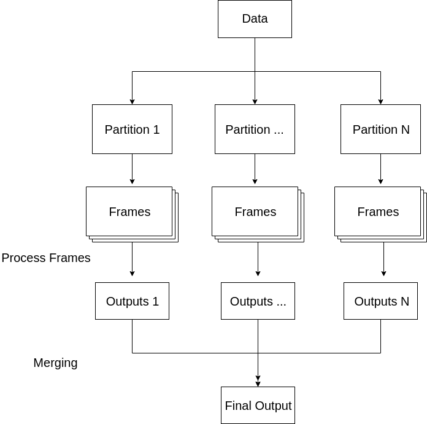

User-defined functions
======================

A common case for analysing big EM data sets is running a reduction operation
on each individual detector frame or other small subsets of a data set and then combining the results of these reductions to form the complete result.
The user-defined functions (UDF) interface of LiberTEM allows users to run their
own reduction functions easily, without having
to worry about parallelizing, I/O, the details of buffer management and so on. This corresponds to a simplified `MapReduce programming model <https://en.wikipedia.org/wiki/MapReduce>`_ where the intermediate re-keying and shuffling step is omitted.

How UDF works in layman's terms
-----------------------------------

The UDF interface of LiberTEM is heavily utilizing the existing LiberTEM architecture. First,
data is partitioned into several `"partitions"` and distributed across workers. Then, each partition,
which can be viewed as a collection of frames, are processed by the user-defined :meth:`process_frame` or :meth:`process_tile` method. Tiles are described in more detail in `tiled processing`_ and are useful to improve the performance of some numerical operations. In the following, the simpler :meth:`process_frame` interface is described first.
Here, frames or tiles are fetched in an iterative manner, and the :meth:`process_frame` or :meth:`process_tile` method performs user-defined operations
on the frames. After all the frames in a partition are processed, LiberTEM iteratively `merges` the results from each worker, which is called
by the :meth:`merge` method in UDF class. To summarize, the UDF interface of LiberTEM performs operations at two levels: :meth:`process_frame`, which performs user-defined operations
on frames within each partition, and :meth:`merge`, which merges the output of :meth:`process_frame` from each partition. Note that in both :meth:`process_frame` and :meth:`merge`, buffers store the intermediate
outcomes of the user-defined operations.

Initializing Buffers
--------------------
In the UDF interface of LiberTEM, buffers are the tools to save and pass on the
intermediate results of computation. Currently, LiberTEM supports three different
types of buffer: :code:`"sig"`, :code:`"nav"`, and :code:`"single"`. By setting :code:`kind="sig"`, users
can make the buffer to have the same dimension as the signal dimension. By setting
the :code:`kind="nav"`, users can make the buffer to have the same dimension as the navigation
dimension. Lastly, by setting :code:`kind="single"`, users can make the buffer to have an arbitrary 
dimension of their choice. Note that in the case of :code:`"single"` buffer, users may specify 
the dimension of the buffer through :code:`extra_shape` parameter. If :code:`extra_shape` 
parameter is not specified, the buffer is assumed to have :code:`(1,)` dimension. Additionally, 
users may also specify :code:`extra_shape` parameters for :code:`"sig"` or :code:`"nav"` buffers. 
In that case, the dimensions specified by :code:`extra_shape` parameter will be added to the 
dimension of :code:`dataset.shape.sig` or :code:`dataset.shape.nav`, with respect to each component. As an example,
one may specify the buffers as following:

.. include:: udf/buffer_types.py
   :code:

One can access a buffer of interest via :code:`self.results.<buffername>`, from which one can get a view into a numpy array
that the buffer is storing. This numpy array corresponds to the current intermediate result that LiberTEM is working
on and can be intermediate results of processing frames/tiles/partitions. 
Note that buffers are only designed to pass lightweight intermediate results and thus, it is important
that the size of the buffer remains small. Otherwise, it could lead to significant decline in performance.

All numpy dtypes are supported for buffers. That includes the :code:`object` dtype for arbitrary Python variables. The item just has to be pickleable with :code:`cloudpickle`.

By-frame processing
-------------------
Note that :meth:`process_frame` method can interpreted in a slightly different manner for different types of buffer with which you
are dealing. If the type of the buffer is :code:"sig", then :meth:`process_frame` can be viewed as iteratively `merging` the previous
computations (i.e., the result computed on previously considered set of frames) and a newly added frame. If the type of
the buffer is :code:`"nav"`, then :meth:`process_frame` can be viewed as performing operations on each frame independently. Intuitively, when the type of the buffer is :code:`"nav"`, which means that it uses the navigation dimension, two different frames
correspond to two different scan positions, so the `merging` is in fact an assignment of the result to the correct slot in the result buffer. Lastly, if the type of the buffer is :code:`"single"`, then :meth:`process_frame` can be
interpreted in either way.

As an easy example, let's have a look at a function that simply sums up each frame
to a single value:

.. include:: udf/sumsig.py
   :code:

Here is another example, demonstrating :code:`kind="sig"` buffers and the merge function:

.. include:: udf/max.py
   :code:

For a more complete example, please have a look at the functions implemented in the sub-modules of :code:`libertem.udf`,
for example :code:`libertem.udf.blobfinder`.

Auto UDF
--------

The :class:`AutoUDF` class and :meth:`Context.map()` method allow to run simple functions that accept a frame as the only parameter with an auto-generated :code:`kind="nav"` result buffer over a dataset ad-hoc without defining an UDF class. For more advanced processing, such as custom merge functions, postprocessing or performance optimization through tiled processing, defining an UDF class is required.

The :class:`AutoUDF` class determines the output shape and type by calling the function with a mock-up frame of the same type and shape as a real detector frame and converting the return value to a numpy array. The :code:`extra_shape` and :code:`dtype` parameters for the result buffer are derived automatically from this numpy array. Additional constant parameters can be passed to the function via :meth:`functools.partial`, for example. The return value should be much smaller than the input size for this to work efficiently.

Example: Calculate sum over the last signal axis.

.. code-block:: python

      result = ctx.map(
            dataset=dataset,
            f=functools.partial(np.sum, axis=-1)
      )

Tiled processing
----------------

Motivation
~~~~~~~~~~

Many operations operations can be optimized by working on stacks of frames. For
example, let's imagine you want to do an elementwise multiplication, which arises
when doing gain correction.  An implementation in pseudo-Python could look like this
(for simplicity, we flatten the frame, weights and result to a 1D array here):

.. code-block:: python

   for idx in range(number_of_pixels):
      result[idx] = frame[idx] * weights[idx]

If you look closely, you may notice that for each frame, all elements from :code:`weights` are accessed.
This is not cache efficient, because you could instead hold on to a single weight value and re-use
it for multiple frames:

.. code-block:: python

   for idx in range(number_of_pixels):
      weight = weights[idx]
      for frame_idx, frame in enumerate(frames):
         result[idx, frame_idx] = frame[idx] * weight

For details, see for example the Wikipedia articles on `Loop nest optimization <https://en.wikipedia.org/wiki/Loop_nest_optimization>`_ and `Locality of reference <https://en.wikipedia.org/wiki/Locality_of_reference>`_.

   
In a real Python implementation, you would of course use numpy with broadcasting,
which takes care of applying the multiplication in an efficient way. But it can only
benefit from the above mentioned re-use if it has data from multiple frames available:

.. code-block:: python
   
   # `tile` and `gain_map` have compatible shapes;
   # tile.shape == (N, Y, X) and gain_map.shape == (Y, X)
   corrected_tile = tile * gain_map

These optimizations are only possible if you have access to data from more than one frame. For
very large frames, another problem arises: a stack of frames would be too large to efficiently handle,
as it would no longer fit into even the L3 cache, which is the largest cache in most CPUs. For these
cases, we support a tiled reading and processing strategy. Tiled means we slice the frame into
disjoint rectangular regions. A tile then is the data from a single rectangular region
for multiple frames.

For example, in case of K2IS data, frames have a shape of :code:`(1860, 2048)`. When reading them
with the tiled strategy, a single tile will contain data from 16 subsequent frames, and each
rectangle has a shape of :code:`(930, 16)` (which happens to be the natural block size for K2IS data).
So the tiles will have a shape of :code:`(16, 930, 16)`, and processing 16 frames from the data set
means reading 256 individual tiles.

Loading a tile of this size as float32 data
still fits comfortably into usual L3 CPU caches (~1MB), and thus enables efficient processing.
As a comparison, a whole :code:`(1860, 2048)` frame is about 15MB large, and accessing it repeatedly
means having to load data from the slower main memory.

Note: you may have noticed that we talk about block sizes of 1MB as efficient in the L3 cache,
but many CPUs have larger L3 caches. As the L3 cache is shared between cores, and LiberTEM tries
to use multiple cores, the effectively available L3 cache has to be divided by number of cores.

TODO: documentation on implementing :code:`process_tile`, :code:`process_partition`

Debugging
---------

TODO: `InlineJobExecutor`, `%pdb on`, common pitfalls, ...

API Reference
-------------

.. automodule:: libertem.udf
   :members:
   :special-members: __init__
   :exclude-members: UDFTask,UDFRunner

.. autoclass:: libertem.api.Context
   :members: run_udf,map
   :noindex:
