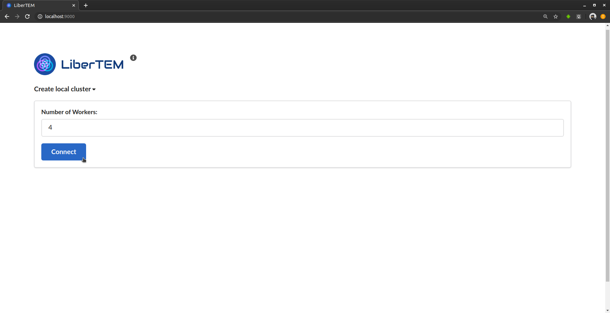
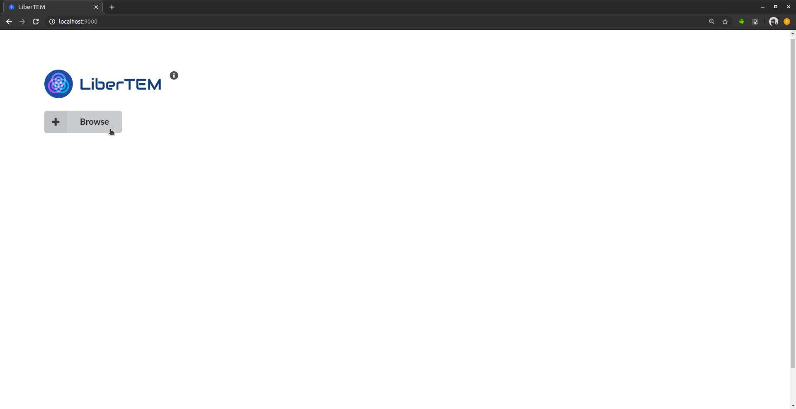
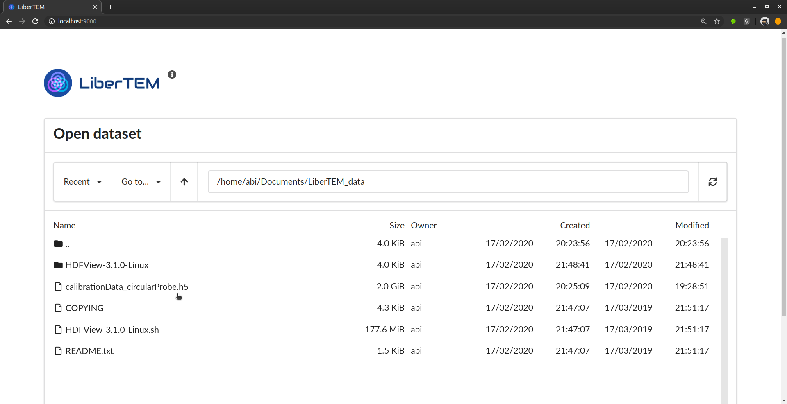
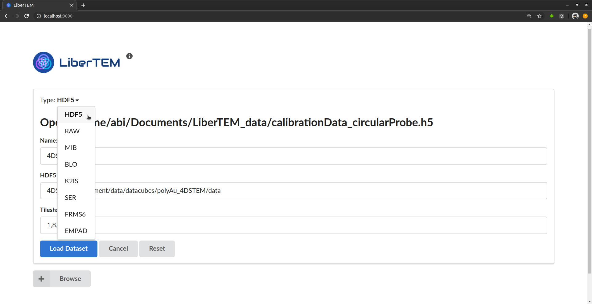
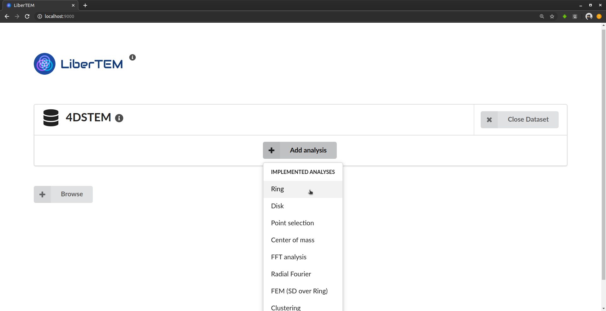
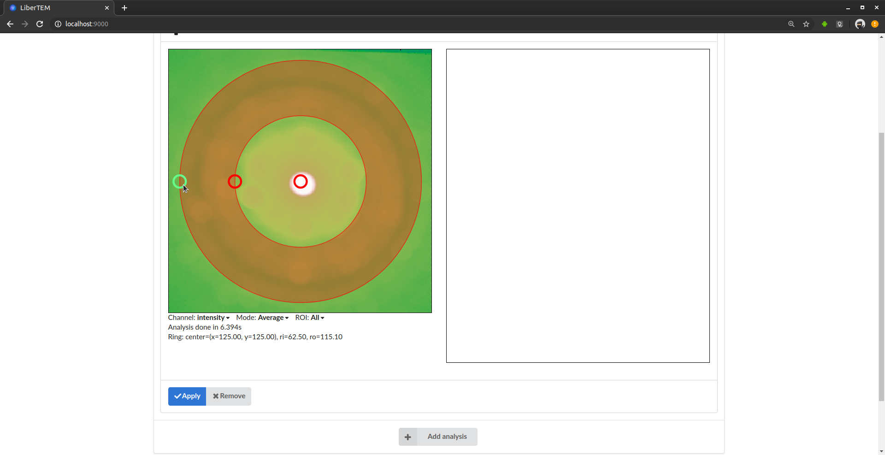
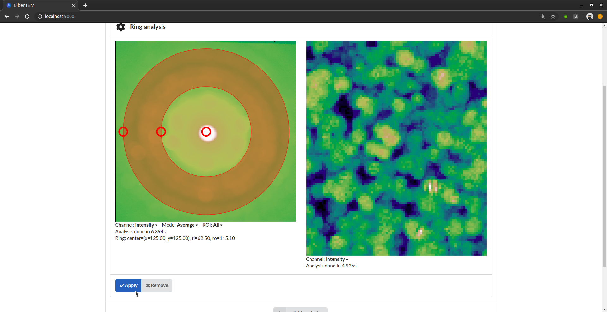
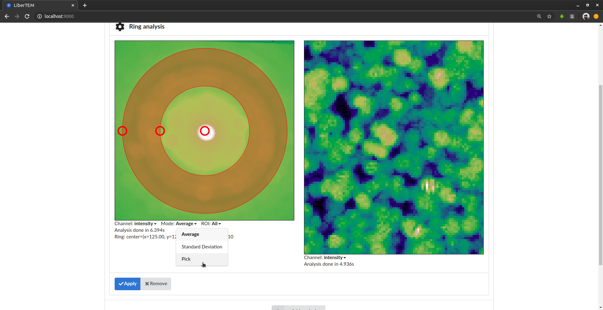
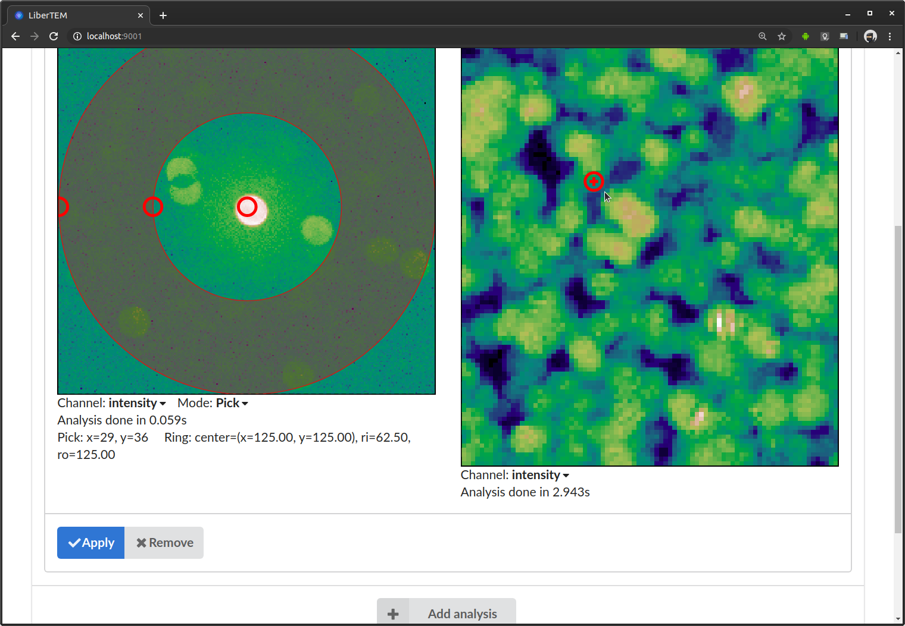
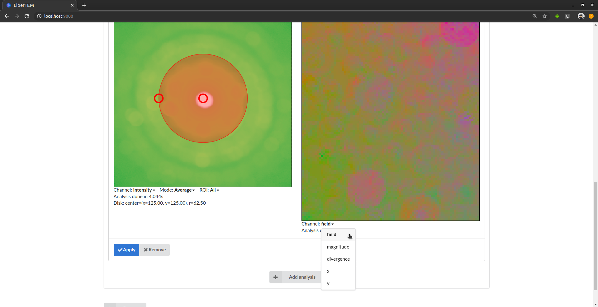

.. _`usage documentation`:

GUI usage
=========

.. include:: _single_node.rst

Starting the LiberTEM server
----------------------------

LiberTEM is based on a client-server architecture. To use the LiberTEM GUI, you need to
have the server running on the machine where your data is available. For using LiberTEM from
Python scripts, this is not necessary, see :ref:`api documentation`.

After :doc:`installing LiberTEM <install>`, activate the virtualenv or conda environment.

You can then start the LiberTEM server by running:

.. code-block:: shell

    (libertem) $ libertem-server

By default, this starts the server on http://localhost:9000, which you can verify by the
log output::

    [2018-08-08 13:57:58,266] INFO [libertem.web.server.main:886] listening on localhost:9000

It will then open your default web browser to this URL.

There are a few command line options available::

    Usage: libertem-server [OPTIONS]

    Options:
      --port INTEGER  port on which the server should listen on
      --local-directory TEXT    local directory to manage dask-worker-space files
      --browser / --no-browser  enable/disable opening the browser
      --help          Show this message and exit.

.. versionadded:: 0.4.0
    :code:`--browser` / :code:`--no-browser` option is added, open browser by default. 

To access LiberTEM remotely, you can use :ref:`use SSH forwarding <ssh forwarding>`.

As there is currently no authentication yet, listening on a different host than
:code:`127.0.0.1` / :code:`localhost` is disabled. As a workaround, if you want
to access LiberTEM from a different computer, you can use ssh port forwarding
(example command for conda):

.. code-block:: shell

     $ ssh -L 9000:localhost:9000 <remote-hostname> "source activate libertem; libertem-server"

Or, with virtualenv:

.. code-block:: shell

     $ ssh -L 9000:localhost:9000 <remote-hostname> "/path/to/virtualenv/bin/libertem-server"

This then makes LiberTEM that is running on :code:`remote-hostname` available on
your local host via http://localhost:9000/

The user interface
------------------

After starting the server, you can open the GUI in your browser. By default it
will be at http://localhost:9000 . At the beginning, the GUI shows a prompt to
create a local cluster or connect to a running one. The number of workers is
preset with a number that will likely give optimal performance on the given
machine.

After connection to a cluster, LiberTEM shows a button to start browsing for
available files. On a local cluster that's simply the local filesystem.

This opens the file browser dialogue. On top it shows the current directory,
below it lists all files and subdirectories in that directory. You select an
entry by clicking once on it. You can move up one directory with the ".." entry
on top of the list. The file browser is still very basic. Possible improvements
are discussed in `Issue #83 <https://github.com/LiberTEM/LiberTEM/issues/83>`_.
Contributions are highly appreciated!

After selecting a file, you set the type in the drop-down menu at the top of the
dialogue above the file name. After that you set the appropriate parameters that
depend on the file type. Clicking on "Load Dataset" will open the file with the
selected parameters. The interface and internal logic to find good presets based
on file type and available metadata, validate the inputs and display helpful
error messages is still work in progress. Contributions are highly appreciated!

See :ref:`Loading using the GUI` for more detailed instructions and
format-specific information.

Once a dataset is loaded, you can add analyses to it. As an example we choose a
"Ring" analysis.

The GUI shows two windows: On the left it shows the current mask. Directly after
adding the analysis, LiberTEM starts calculating an average of all the detector
frames. As soon as this is finished, the average is overlaid with the mask to
help the user with positioning the virtual detector. The window on the right
will later show the result of applying the mask to the data. In the beginning it
is empty. The first processing might take a while depending on file size and IO
performance. Fast SSDs and enough RAM to keep the working files in the file
system cache are highly recommended for a good user experience.

You can adjust the virtual detector by dragging the handles in the GUI. Below it
shows the parameters in numerical form. This is useful to extract positions, for
example for scripting.

After clicking "Apply", LiberTEM performs the calculation and shows the result
in scan coordinates on the right.

If you are interested in individual frames rather than the average, you can
switch to "Pick" mode in the "Mode" drop-down menu directly below the detector
window.

In "Pick" mode, a selector appears in the result frame on the right. You can
drag it around with the mouse to see the frames live in the left window. The
picked coordinates are displayed along with the virtual detector parameters
below the frame window on the left.

Some analyses, such as the Center of Mass (COM) analysis, can render the result
in different ways. You can select the channel in the "Image" drop-down menu
below the right window.

Application-specific documentation
~~~~~~~~~~~~~~~~~~~~~~~~~~~~~~~~~~

For more applications, like strain mapping and crystallinity analysis, please
see the :doc:`Applications <applications>` section.

Keyboard controls
~~~~~~~~~~~~~~~~~

You can use arrow keys to change the coordinate parameters of any analysis. To
do this, click on the handle you want to modify, and then use the arrow keys to
move the handle. Hold shift to move in larger steps.
