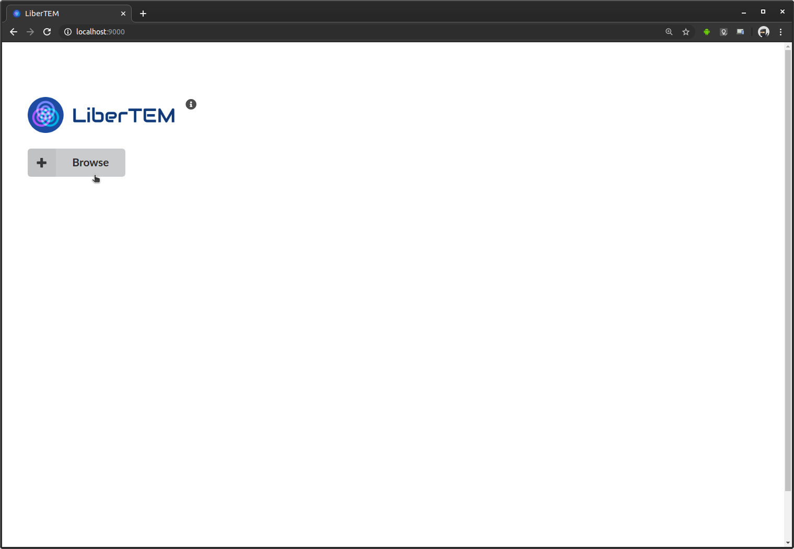
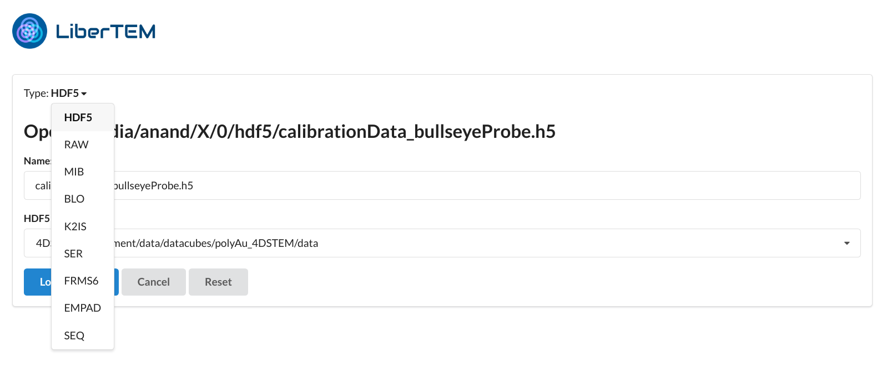
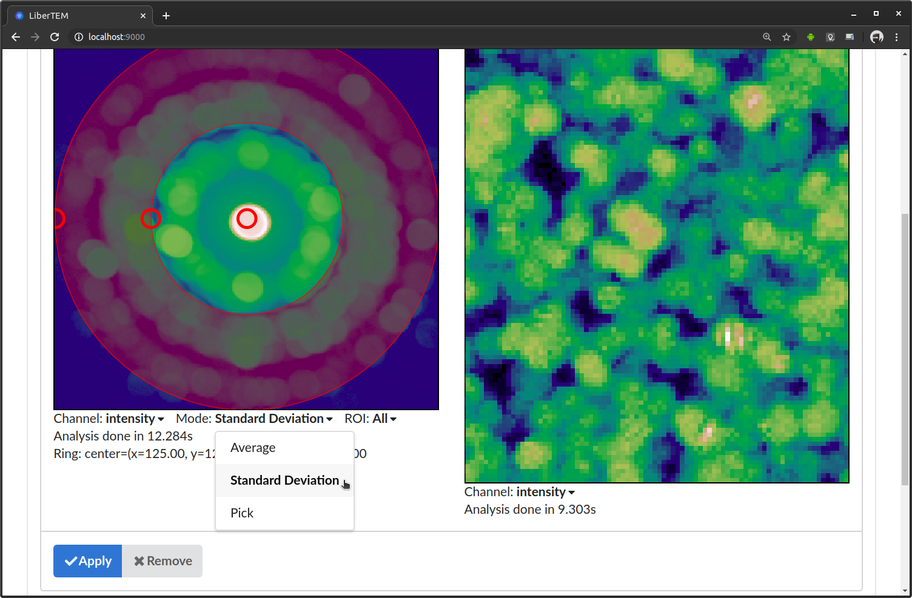
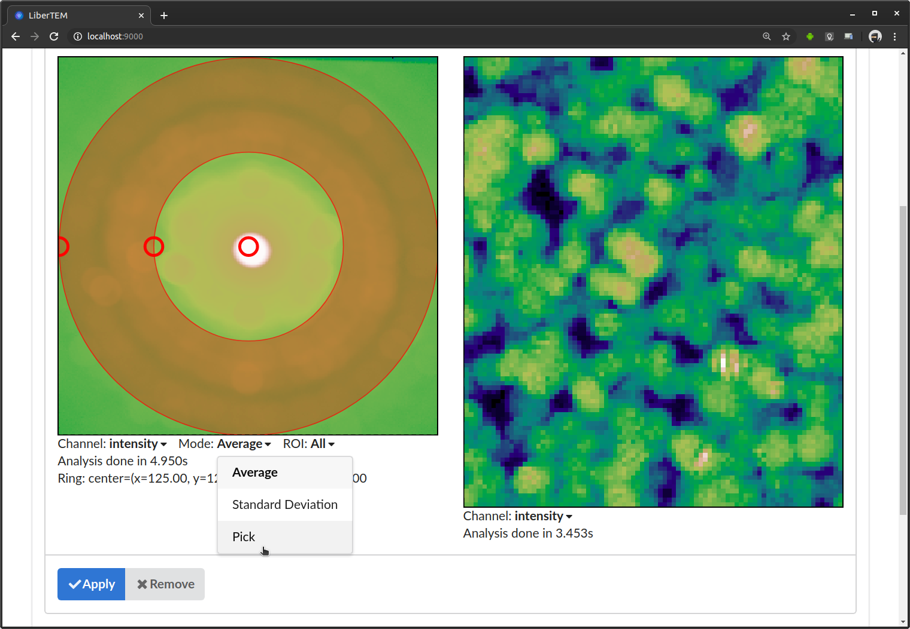

.. _`usage documentation`:

GUI usage
=========

Starting the LiberTEM server
----------------------------

The LiberTEM GUI is based on a client-server architecture. To use the LiberTEM GUI, you need to
have the server running on the machine where your data is available. For using LiberTEM from
Python scripts, this is not necessary, see :ref:`api documentation`.

After :doc:`installing LiberTEM <install>`, activate the virtualenv or conda environment.

You can then start the LiberTEM server by running:

.. code-block:: shell

    (libertem) $ libertem-server

By default, this starts the server on http://localhost:9000, which you can verify by the
log output::

    [2018-08-08 13:57:58,266] INFO [libertem.web.server.main:886] listening on localhost:9000

It will then open your default web browser to this URL.

There are a few command line options available::

    Usage: libertem-server [OPTIONS]

    Options:
      -p, --port INTEGER  port on which the server should listen on
      -d, --local-directory TEXT    local directory to manage dask-worker-space files
      -b, --browser / -n, --no-browser  enable/disable opening the browser
      -l, --log-level TEXT            set logging level. Default is 'info'.
                                      Allowed values are 'critical', 'error',
                                      'warning', 'info', 'debug'.
      --help          Show this message and exit.

.. versionadded:: 0.4.0
    :code:`--browser` / :code:`--no-browser` option was added, open browser by default.
.. versionadded:: 0.6.0
    :code:`-l, --log-level` was added.

To access LiberTEM remotely, you can use :ref:`use SSH forwarding <ssh forwarding>`.

Connecting
----------

.. note::

   The GUI is tested to work on Firefox and Chromium-based browsers for now. If you
   cannot use a compatible browser for some reason, please `file an issue <https://github.com/liberTEM/LiberTEM/issues>`_!

After starting the server, you can open the GUI in your browser. If it didn't open
automatically, you can access it by default at http://localhost:9000 . At the beginning,
the GUI shows a prompt to create a local cluster or connect to a running one.
The number of workers is preset with a number that will likely give optimal
performance on the given machine. You can also select which CUDA devices to use, if you have
any (needs to have a working cupy installation).

..  figure:: ./images/use/create.png

.. _`cluster`:

Starting a custom cluster
-------------------------

LiberTEM can connect to a running Dask cluster. To start a cluster on
:code:`localhost`, first run a scheduler:

.. code-block:: shell

    (libertem) $ dask-scheduler --host localhost

GPU support in LiberTEM requires specific resource tags and environment settings
on the dask workers. The easiest way to start workers with the appropriate
settings is

.. code-block:: shell

    (libertem) $ libertem-worker tcp://localhost:8786

There are a few command line options available::

    Usage: libertem-worker [OPTIONS] [SCHEDULER]

    Options:
    -k, --kind TEXT             Worker kind. Currently only "dask" is
                                implemented.
    -d, --local-directory TEXT  local directory to manage temporary files
    -c, --n-cpus INTEGER        Number of CPUs to use, defaults to number of CPU
                                cores without hyperthreading.
    -u, --cudas TEXT            List of CUDA device IDs to use, defaults to all
                                detected CUDA devices. Use "" to deactivate
                                CUDA.
    -n, --name TEXT             Name of the cluster node, defaults to host name
    -l, --log-level TEXT        set logging level. Default is 'info'. Allowed
                                values are 'critical', 'error', 'warning',
                                'info', 'debug'.
    --help                      Show this message and exit.

.. versionadded:: 0.6.0

For a cluster setup, you can run the scheduler on the appropriate network interface and
run workers on all cluster nodes to connect to the scheduler.

You can then connect to the cluster's scheduler URL in the LiberTEM web GUI.

Opening data
------------

After connection to a cluster, LiberTEM shows a button to start browsing for
available files. On a local cluster that's simply the local filesystem.

.. note:: See :ref:`sample data` for publicly available datasets.

This opens the file browser dialogue. On top it shows the current directory,
below it lists all files and subdirectories in that directory. You select an
entry by clicking once on it. You can move up one directory with the ".." entry
on top of the list. The file browser is still very basic. Possible improvements
are discussed in `Issue #83 <https://github.com/LiberTEM/LiberTEM/issues/83>`_.
Contributions are highly appreciated! This example opens an HDF5 file :cite:`Zeltmann2019`.

..  figure:: ./images/use/open.png

You can also bookmark locations you frequently need to access, using the
star icon. The bookmarks are then found under "Go to...".

..  figure:: ./images/use/star.png

After selecting a file, you set the type in the drop-down menu at the top of the
dialogue above the file name. After that you set the appropriate parameters that
depend on the file type. Clicking on "Load Dataset" will open the file with the
selected parameters. The interface and internal logic to find good presets based
on file type and available metadata, validate the inputs and display helpful
error messages is still work in progress. Contributions are highly appreciated!

See :ref:`Loading using the GUI` for more detailed instructions and
format-specific information.

Running analyses
----------------

Once a dataset is loaded, you can add analyses to it. As an example we choose a
"Ring" analysis, which implements a ring-shaped virtual detector.

..  figure:: ./images/use/add_analysis.png

..  figure:: ./images/use/adjust.png

This analysis shows two views on your data: the two detector dimensions on
the left, the scanning dimensions on the right, assuming a 4D-STEM dataset.
For the general case, we also call the detector dimensions the *signal
dimensions*, and the scanning dimensions the *navigation dimensions*.
See also :ref:`concepts` for more information on axes and coordinate system.

Directly after
adding the analysis, LiberTEM starts calculating an average of all the detector
frames. The average is overlaid with the mask representing the virtual detector. The view on the right
will later show the result of applying the mask to the data. In the beginning it
is empty. The first processing might take a while depending on file size and I/O
performance. Fast SSDs and enough RAM to keep the working files in the file
system cache are highly recommended for a good user experience.

You can adjust the virtual detector by dragging the handles in the GUI. Below it
shows the parameters in numerical form. This is useful to extract positions, for
example for scripting.

After clicking "Apply", LiberTEM performs the calculation and shows the result
in scan coordinates on the right side.

..  figure:: ./images/use/apply.png

Instead of average, you can select "Standard Deviation". This calculates
standard deviation of all detector frames.

If you are interested in individual frames rather than the average, you can
switch to "Pick" mode in the "Mode" drop-down menu directly below the detector
window.

In "Pick" mode, a selector appears in the result frame on the right. You can
drag it around with the mouse to see the frames live in the left window. The
picked coordinates are displayed along with the virtual detector parameters
below the frame window on the left.

..  figure:: ./images/use/pick_frame.png

If you are interested in a limited region, the ROI dropdown provides the option
to select a rectangular region. For example if you select "Rect", the
average/standard deviation is calculated over all images that lie inside selected
rectangle. You can adjust the rectangle by dragging the handles in the GUI.

Some analyses, such as the Center of Mass (COM) analysis, can render the result
in different ways. You can select different result channels in the "Channel" drop-down menu
below the right window.

..  figure:: ./images/use/image.png

.. _`download results`:

Downloading results
-------------------

After an analysis has finished running, you can download the results. Clicking the download button
below the analysis will open a dialog:

In the download dialog, you can choose between different file formats, and separately
download the available results.

..  figure:: ./images/use/download-modal.png

You can also download a Jupyter notebook corresponding to the analysis and
continue working with the same parameters using scripting.

.. figure:: ./images/use/download-jupyter.png

It's also possible to copy individual cells of Jupyter notebook directly from GUI, with an option
to copy the complete source code.

.. figure:: ./images/use/copy-jupyter.png

Keyboard controls
~~~~~~~~~~~~~~~~~

You can use arrow keys to change the coordinate parameters of any analysis. To
do this, click on the handle you want to modify, and then use the arrow keys to
move the handle. Hold shift to move in larger steps.

Application-specific documentation
~~~~~~~~~~~~~~~~~~~~~~~~~~~~~~~~~~

For more applications, like strain mapping and crystallinity analysis, please
see the :doc:`Applications <applications>` section.
