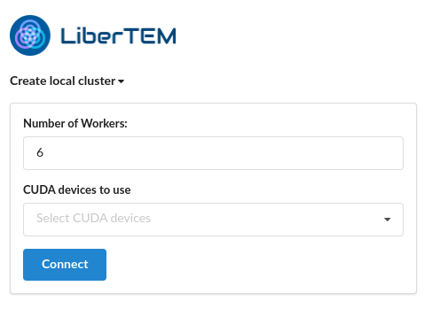
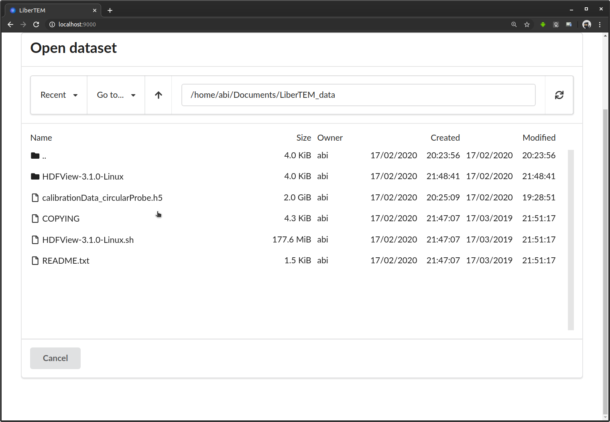

Usage
=====

.. include:: _single_node.rst

Starting the LiberTEM Server
----------------------------

LiberTEM is based on a client-server architecture. To use LiberTEM, you need to
have the server running on the machine where your data is available.

After :doc:`installing LiberTEM <install>`, activate the virtualenv or conda environment.

You can then start the LiberTEM server by running:

.. code-block:: shell

    (libertem) $ libertem-server

By default, this starts the server on http://localhost:9000, which you can verify by the
log output::

    [2018-08-08 13:57:58,266] INFO [libertem.web.server.main:886] listening on localhost:9000

There are a few command line options available:: 

    Usage: libertem-server [OPTIONS]

    Options:
      --port INTEGER  port on which the server should listen on
      --help          Show this message and exit.
    
As there is currently no authentication yet, listening on a different host than
`127.0.0.1` / `localhost` is disabled. As a workaround, if you want to access LiberTEM from a different computer,
you can use ssh port forwarding (example command for conda):

.. code-block:: shell

     $ ssh -L 9000:localhost:9000 <remote-hostname> "source activate libertem; libertem-server"

Or, with virtualenv:

.. code-block:: shell

     $ ssh -L 9000:localhost:9000 <remote-hostname> "/path/to/virtualenv/bin/libertem-server"

This then makes LiberTEM that is running on `remote-hostname` available on your local host via http://localhost:9000/

The user interface
------------------

After starting the server, you can open the GUI in your browser. By default it will be at http://localhost:9000 .
At the beginning, the GUI shows a prompt to create a local cluster or connect to a running one. The number of workers is preset with a number 
that will likely give optimal performance on the given machine.

After connection to a cluster, LiberTEM shows a button to start browsing for available files. On a local cluster that's simply
the local filesystem.

..  figure:: ./images/use/browse.png

This opens the file browser dialogue. On top it shows the current directory, below it lists all files and subdirectories in that directory. You select an entry by clicking once on it.
You can move up one directory with the ".." entry on top of the list. The file browser is still very basic. Possible improvements are discussed in `Issue #83 <https://github.com/LiberTEM/LiberTEM/issues/83>`_. Contributions are highly appreciated!

After selecting a file, you set the type in the drop-down menu at the top of the dialogue above the file name. After that you set the appropriate parameters that depend on the file type. Clicking on "Load Dataset" will open the file with the selected parameters. The interface and internal logic to find good presets based on file type and available metadata, validate the inputs and display helpful error messages is still work in progress. Contributions are highly appreciated! TODO documentation of all supported file types and their parameters.

* K2IS: You can open any of the files that belong to a K2IS data set and LiberTEM will find the remaining ones, provided they follow the default naming scheme.

..  figure:: ./images/use/type.png

Once a dataset is loaded, you can add analyses to it. As an example we choose a "Ring" analysis.

..  figure:: ./images/use/add_analysis.png

The GUI shows two windows: On the left it shows the current mask. Directly after adding the analysis, LiberTEM starts calculating an average of all the detector frames. As soon as this is finished, the average is overlaid with the mask to help the user with positioning the virtual detector. The window on the right will later show the result of applying the mask to the data. In the beginning it is empty. The first processing might take a while depending on file size and IO performance. Fast SSDs and enough RAM to keep the working files in the file system cache are highly recommended for a good user experience. 

You can adjust the virtual detector by dragging the handles in the GUI. Below it shows the parameters in numerical form. This is useful to extract positions, for example for scripting.

..  figure:: ./images/use/adjust.png

After clicking "Apply", LiberTEM performs the calculation and shows the result in scan coordinates on the right. 

..  figure:: ./images/use/apply.png

If you are interested in individual frames rather than the average, you can switch to "Pick" mode in the "Mode" drop-down menu directly below the detector window.

..  figure:: ./images/use/pick.png

In "Pick" mode, a selector appears in the result frame on the right. You can drag it around with the mouse to see the frames live in the left window. The picked coordinates are displayed along with the virtual detector parameters below the frame window on the left.

..  figure:: ./images/use/pick_frame.png

Some analyses, such as the Center of Mass (COM) analysis, can render the result in different ways. You can select the channel in the "Image" drop-down menu below the right window.

..  figure:: ./images/use/image.png

Keyboard controls
~~~~~~~~~~~~~~~~~

You can use arrow keys to change the coordinate parameters of any analysis. To do this, click on the
handle you want to modify, and then use the arrow keys to move the handle.
Hold shift to move in larger steps.

The Python API
--------------

The Python API is a concise API for using LiberTEM from Python code. It is suitable both
for interactive scripting, for example from jupyter notebooks, and for usage
from within a Python application.

This is a basic example to load the API, create a local cluster, load a file and run a job. For a complete example on how to use the Python API, please see the
jupyter notebooks in `the example directory <https://github.com/LiberTEM/LiberTEM/tree/master/examples>`_.

For a full API reference, please see :doc:`Reference <reference>`.

.. include:: /../../examples/basic.py
    :code:

User-defined functions
~~~~~~~~~~~~~~~~~~~~~~

A common case for analysing big EM data sets is running a reduction operation
on each frame of the data set. The user-defined functions (UDF) interface
of LiberTEM allows users to run their own reduction functions easily, without having
to worry about parallelizing, I/O, the details of buffer management and so on. As an easy example, let's
have a look at a function that simply sums up each frame to a single value:

.. code-block:: python

   from libertem.api import Context
   from libertem.common.buffers import BufferWrapper

    def make_pixelsum_buffer():
        """
        Describe the buffers we need to store our results:
        kind="nav" means we want to have a value for each coordinate
        in the navigation dimensions. We name our buffer 'pixelsum'.
        """
        return {
            'pixelsum': BufferWrapper(
                kind="nav", dtype="float32"
            )
        }

    def make_pixel_sum(frame, pixelsum):
        """
        Sum up all pixels in this frame and store the result in the pixelsum buffer.
        `pixelsum` is a view into the result buffer we defined above, and corresponds to the
        entry for the current frame we work on. We don't have to take care of finding the correct
        index for the frame we are processing ourselves.
        """
        pixelsum[:] = np.sum(frame)

    # run the UDF on a dataset:
    ctx = Context()
    dataset = ctx.load("...")
    res = ctx.run_udf(
        dataset=dataset,
        fn=make_pixel_sum,
        make_buffers=make_pixelsum_buffer,
    )

Here is another example, demonstrating `kind="sig"` buffers and the merge function:

.. code-block:: python

   from libertem.api import Context
   from libertem.common.buffers import BufferWrapper

   def make_buffer():
       """
       Describe the buffers we need to store our results:
       kind="sig" means we want to have a value for each coordinate
       in the signal dimensions (i.e. a value for each pixel of the diffraction patterns).
       We name our buffer 'maxbuf'.
       """
       return {
           'maxbuf': BufferWrapper(
               kind="sig", dtype="float32"
           )
       }

   def make_max(frame, maxbuf):
       """
       In this function, we have a frame and the buffer `maxbuf` available, which we declared above.
       This function is called for all frames / diffraction patterns in the data set. The maxbuf is
       a partial result, and all partial results will later be merged (see below).

       In this case, we determine the maximum from the current maximum and the current frame, for each
       pixel in the diffraction pattern.

       Notes:

        - You cannot rely on any particular order of frames this function is called in.
        - Your function should be pure, that is, it should not have side effects and should
          only depend on it's input parameters.
       """
       maxbuf[:] = np.maximum(frame, maxbuf)

   def max_merge(dest, src):
       """
       merge two partial results, from src into dest
       """
       dest['maxbuf'][:] = np.maximum(dest['maxbuf'], src['maxbuf'])

   ctx = Context()
   ds = ctx.load("...")
   res = ctx.run_udf(
       dataset=ds,
       fn=make_max,
       make_buffers=make_buffer,
       merge=max_merge,
   )

For a more complete example, please have a look at the functions implemented in `libertem.udf`,
for example `blobfinder`. Note that this is a quite new feature and the API is not stable yet!

From an embedded interpreter
----------------------------

If LiberTEM is run from within an embedded interpreter, the following steps should be taken. This is necessary for Python scripting in Digital Micrograph, for example.

The variable :code:`sys.argv` `may not be set in embedded interpreters <https://bugs.python.org/issue32573>`_, but it is expected by the :code:`multiprocessing` module when spawning new processes. This workaround guarantees that :code:`sys.argv` is set `until this is fixed upstream <https://github.com/python/cpython/pull/12463>`_:

.. code-block:: python
    
    if not hasattr(sys, 'argv'):
        sys.argv  = []

Furthermore, the `correct executable for spawning subprocesses <https://docs.python.org/3/library/multiprocessing.html#multiprocessing.set_executable>`_ has to be set. 

.. code-block:: python
    
    multiprocessing.set_executable(
        os.path.join(sys.exec_prefix, 'pythonw.exe'))  # Windows only
