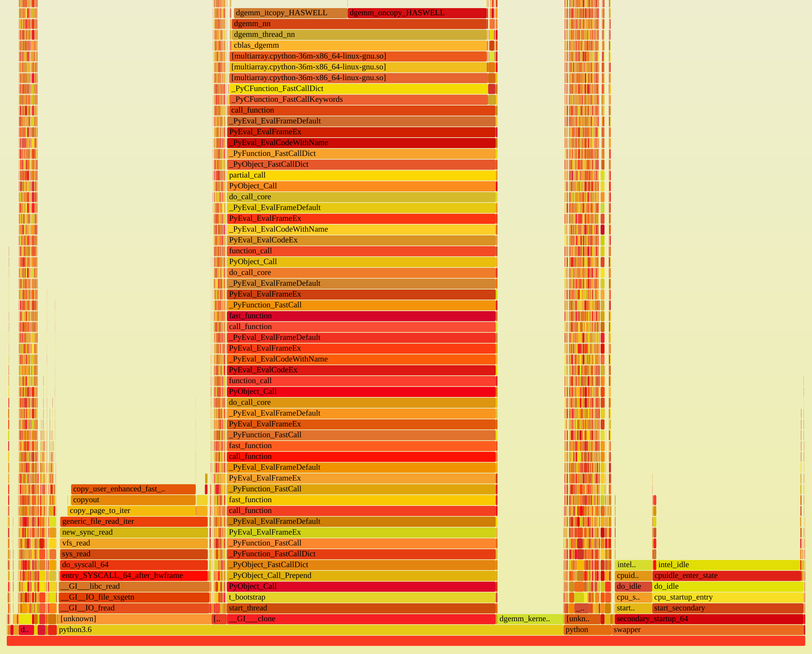

Why Python?
===========

Python is well established in the scientific community. It is usable both for
developers, but also for many microscopists.

Its high-level construct allow for fast iteration and prototyping. There is an
extensive exosystem of packages for scientific computation leveraging existing
native libraries. Python has good interoperability with low-level languages
like C, which means it is well suited as a glue language for existing low-level
routines, without introducing inefficiencies such as copies of large buffers on
each interaction.

Isn't Python slow?
------------------

Yes, but we only use Python for setting up the computation, creating buffers,
setting parameters, etc. We use it as a glue language for native parts
(libhdfs3, numpy/OpenBLAS, ...).

See for example this profile, visualized as a flamegraph:

The workload is similar to what LiberTEM will later do: it reads files from HDFS
and does matrix multiplication on the data.

Most of the time is spent reading the file (block on the left: `sys_read`) or
actually performing the matrix multiplication (center block: anything containing `dgemm`).
The Python parts are mostly in the narrow (= little time) but high (= deep call stacks)
pillar on the right. The dask scheduler is also visible in the profile, but takes up
less than 2% of the total samples.

Note the `swapper` part on the right: this was a full-system profile, so unrelated
things like `swapper` or `intel_idle` are also included. 

But what about (multicore) scaling?
-----------------------------------

``numpy`` releases the GIL, so multiple threads can work at the same time. Even if
this were not the case, we can still use the multiprocessing workers of ``dask.distributed``
and scale to multiple cores. See also the
`notebook <https://github.com/LiberTEM/LiberTEM/blob/master/examples/multicore_scalability.ipynb>`_ 
that explores the different parameters (number of processes, number of masks, number of frames processed at once).
